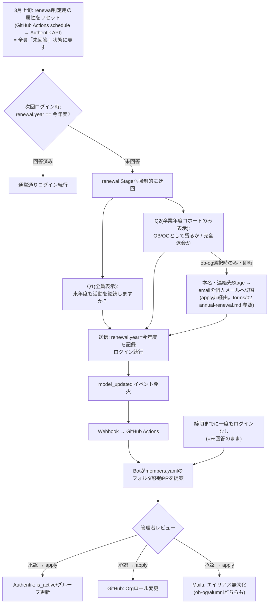

# メンバーライフサイクル設計（卒業・OB/OG・年次継続）

`03-member-management.md` のファイル構成・PII 管理方針を前提とします。

---

## 課題認識

「卒業」と「継続」は別の軸の問題です。

| 軸 | 対象 | 頻度 | 既存設計の穴 |
| --- | --- | --- | --- |
| 卒業時の移行 | 卒業年度（`grad-<年度>`）の学生のみ | 年1回・その学年限定 | OB/OG という受け皿がなく `alumni`（実質退会）に一足飛び |
| 年次の継続願 | **在籍中の全メンバー**（学年問わず） | 年1回・全員 | 個人単位の意思確認プロセスが存在せず、フォルダに人がいる＝継続扱いになっていた（幽霊部員を検知できない） |

この2つを、**毎年3月に1回まとめて回す年次サイクル**として統合設計します。
継続願は現状 Google フォームで回収していますが、これを Authentik ネイティブなフローに
置き換えます（設計は「年次サイクル」節を参照）。

---

## メンバーステータスの3層モデル

`active` / `alumni` の二値だったところに `ob-og` を追加します。
ステータスはメンバーごとの独立フィールドではなく、**既存設計を踏襲してトップレベルフォルダで表現**します
（`03-member-management.md` の「フォルダ移動＝状態遷移」という設計方針と整合させるため）。

```text
platform/members/
├── active/
│   └── grad-2027/
│       ├── members.yaml              # id・role: circle-admin | member（平文）
│       ├── members_secrets.yaml.enc  # email・student_id（暗号化）
│       └── auto-gen-members.yaml     # username・display_name（平文）
├── ob-og/                             # ← 新設
│   └── grad-2025/
│       ├── members.yaml              # id・role: ob-og（平文のまま。id が見えること自体は問題ない）
│       ├── members_secrets.yaml.enc  # email・student_id（暗号化。既存通り）
│       └── auto-gen-members.yaml.enc # username・display_name（★暗号化に変更。下記「卒業後の匿名化」参照）
└── alumni/
    └── grad-2024/
        ├── members.yaml              # id・role: alumni（平文のまま）
        ├── members_secrets.yaml.enc  # email・student_id（暗号化。既存通り）
        └── auto-gen-members.yaml.enc # username・display_name（★暗号化に変更）
```

### `role` フィールドの扱い

`ob-og` / `alumni` を「role の値が無視される特別扱い」にするのをやめ、
`circle-admin` | `member` | `ob-og` | `alumni` をすべて対等な `role` の値として扱います。
フォルダ移動時に `role` もその値へ書き換えます（卒業した部長が `circle-admin` のままにならないよう、
「無視する」ではなく「明示的に上書きする」形にします）。

### 卒業後の匿名化: `lcn_xxxxxx` の ID だけは残し、それ以外は伏せる

**意図**: 在学中（`active`）は `id`・`username`・`display_name` が Git 上で平文なのは現状通り問題ありません。
しかし卒業後は「内部 ID (`lcn_xxxxxx`) が記録され続けること自体は構わないが、
それが自分の username・表示名・GitHub アカウント・Discord アカウントと紐づいているのは
見られたくない」という人がいます。そこで **`ob-og` / `alumni` になった時点で、
`lcn_xxxxxx` という不透明な ID 以外の「人物を特定できる情報」をすべて暗号化**します。

| ファイル | active | ob-og / alumni |
| --- | --- | --- |
| `members.yaml`（id・role） | 平文 | 平文のまま（`id` 単体は特定情報ではないため） |
| `members_secrets.yaml.enc`（email・student_id） | 暗号化 | 暗号化（変更なし） |
| `auto-gen-members.yaml`（username・display_name） | 平文 | **暗号化**（新規） |
| `auto-gen-github-usernames.yaml`（GitHub username） | 平文 | **該当エントリを暗号化ファイルへ移す**（下記参照） |
| `auto-gen-discord-ids.yaml`（Discord ID、`04-discord-integration.md`） | 平文 | **同上** |

`auto-gen-github-usernames.yaml` / `auto-gen-discord-ids.yaml` は現状リポジトリ直下の
1ファイルに全メンバー分が `id: 値` の形でフラットに入っています（コホートフォルダをまたぐ）。
これを `ob-og` / `alumni` になったメンバーについてだけ暗号化しようとすると、
1ファイル内で一部のエントリだけ暗号化・一部平文という扱いにくい状態になるため、
**該当メンバーのエントリをそのフラットファイルから削除し、
コホートフォルダ側の `auto-gen-github-usernames.yaml.enc` / `auto-gen-discord-ids.yaml.enc`
（`auto-gen-members.yaml.enc` と同様、コホート単位で分割する粒度）へ移し替える**運用にします。

```text
ob-og/grad-2025/
├── members.yaml
├── members_secrets.yaml.enc
├── auto-gen-members.yaml.enc
├── auto-gen-github-usernames.yaml.enc   # ← フラットファイルから移動
└── auto-gen-discord-ids.yaml.enc        # ← フラットファイルから移動
```

暗号化は SOPS の非対称性を利用し、**フォルダ移動 PR を作る Bot が公開鍵だけで暗号化**します
（秘密鍵を Bot に持たせる必要はありません。`forms/03-contact-info.md` で説明した設計と同じ考え方です）。

### この設計の限界（要認識）

- SOPS は**値**を暗号化しますが、YAML の**構造**（キー名・リストの要素数）は平文のまま残ります。
  そのため「そのコホートに何人 `ob-og` / `alumni` がいるか」という人数自体は
  Git 上で見えたままです。個々の `id`・`role` の**値**は暗号化されますが、`members.yaml` は
  今回 `id`・`role` を平文のまま残す設計にしたので、そもそもこの制約は影響しません
  （影響するのは `auto-gen-members.yaml.enc` 等の暗号化対象ファイルの方です）。
- **過去の Git 履歴は遡って隠せません**。あるメンバーが `active` だった間のコミットには
  username・display_name が平文で残っています。今回の暗号化は「今後 `ob-og`/`alumni` に
  移った後の状態」を暗号化するだけで、過去のコミット履歴の書き換え（`git filter-repo` 等）は
  別途の、より重い意思決定が必要な作業として切り離します。

---

## `ob-og` / `alumni` の定義（連絡の可否で線引きする）

`ob-og` / `alumni` を分ける本質は**サークルから連絡を取り続けてよいかどうか**です。
Q2 の回答に基づき、以下のように定義します。

| ステータス | 条件 |
| --- | --- |
| `ob-og` | Q2 で「OB/OGとして関わる（＝連絡を受け取ってよい）」と明示的に回答した |
| `alumni` | Q2 で「連絡は不要」と明示的に回答した、**または**無回答のまま締切を迎えた |

無回答を `alumni` 側に倒すのは、既存の opt-in 原則（意思表示がなければ最小権限側に倒す）と整合的です。
「連絡してよいと言われていない人に連絡し続けない」という個人情報保護の観点からも自然です。

### 全パターンの遷移先（Bot が PR を提案する際の判定表）

上の表は卒業年度コホート（Q2 が表示される人）だけを扱っています。**卒業年度でないコホートが
Q1 で「継続しない」/ 無回答だった場合の遷移先は、これまで明文化していませんでした。**
（Q2 は卒業年度のみに表示されるため、非卒業学年のメンバーは `ob-og` を選びようがなく、
「連絡を取り続けてよいか」という問い自体が発生しません。したがって非卒業学年の離脱者は
常に `alumni` 一択になります。）以下が全パターンです。

| 卒業年度コホートか | Q1 | Q2 | 遷移先 |
| --- | --- | --- | --- |
| 該当しない | 継続する | （表示されない） | `active` のまま（変更なし） |
| 該当しない | 継続しない | （表示されない） | `alumni` |
| 該当しない | 無回答 | （表示されない） | `alumni` |
| 該当する | （Q1の回答は使わない） | OB/OGとして関わる | `ob-og` |
| 該当する | （Q1の回答は使わない） | 連絡は不要 | `alumni` |
| 該当する | （Q1の回答は使わない） | **留年するので卒業しない** | `active`（`grad_year` を来年度に更新。`grad-<今年度>/` → `grad-<来年度>/` へフォルダ移動） |
| 該当する | （Q1の回答は使わない） | 無回答（Q2未到達含む） | `alumni` |

「留年するので卒業しない」（`repeat-year`）は当初の設計に無かった抜けで、後から追加しました。
詳細は [forms/02-annual-renewal.md](forms/02-annual-renewal.md) の「`repeat-year`（留年届）について」参照。
留年の回数に上限を設けるかは未決事項です（下記参照）。

### `ob-og` の実像: 「IdPとしては生きているが LC-Cloud のリソースは何もない」状態

`ob-og` は Authentik アカウント自体は生かしたまま、認証の入口だけ変えます。

- **既存実装との食い違い（要確認）**: このドキュメントはこれまで「在学中の `email` は
  `{id}@linuxclub.example` という club alias で、実メールは Authentik に渡さない」という
  `03-member-management.md` に書かれた**方針**を前提にしていました。しかし実際の
  `terraform/platform/members/authentik_users.tf` を確認したところ、
  `email = local.secrets[each.key].email` と**実メールアドレスをそのまま渡しています**
  （club alias にはなっていません）。ドキュメントの方針と実コードが元々食い違っており、
  今回のセッションで作った矛盾ではありませんが、以下の「`ob-og` 遷移時に email を
  個人メールへ書き換える」という設計は、どちらの現実を前提にするかで意味が変わります。
  実コードの通り「今も実メールが入っている」なら、`ob-og` 遷移は
  「大学メール（実メール） → 個人メール」への書き換えになります。
  この食い違い自体の解消（club alias 方針を実装するか、ドキュメント側を実装に合わせるか）は
  別途の意思決定として扱い、ここでは深追いしません。
- 卒業後は大学メールが使えなくなるため、`ob-og` へ遷移するタイミングで `email` フィールドを
  本人の**個人メールアドレスへ書き換え**、以降はこの個人メールでログインできるようにします。
  **この書き換えは `terraform apply` の一部ではありません**。`forms/03-contact-info.md` の設計上、
  `personal_email` は Authentik のみが保持し Git・Terraform State には一切出さないため、
  Terraform（＝ Git 管理下の宣言的な状態）からこの値を読むことはできません。実際には
  「本名・連絡先 Stage 送信直後に、Authentik 側の Stage/Webhook が Authentik API を直接叩いて
  自分自身の `email` を更新する」という、Terraform を経由しない即時処理になります
  （年次サイクル図の「apply後」ステップに書いていた `email` 切替えは誤りだったため、下記の図から削除しました）。
- **重要な訂正**: これまで `lcn_xxxxxx`（内部 ID）は Authentik 側では
  club alias の local part にしか記録されていない想定でした（上記の通り実際には
  club alias 自体が未実装ですが、design 上の意図としては）。`email` を書き換えると
  この経由での `lcn_xxxxxx` の記録が失われるため、Discord Bot のロール同期・メール認証照合
  （`04-discord-integration.md`）が困る、という問題は変わりません。
  対策として、`student_id` と同じパターンで **`attributes.lcn_id` を明示的な Authentik user attribute
  として持たせます**（`terraform/platform/members/authentik_users.tf` の
  `resource "authentik_user" "members"` にある既存の
  `attributes = jsonencode({ student_id = ... })` へ `lcn_id = each.key` を追記するだけ。
  `terraform/modules/authentik-user` という汎用モジュールは存在しないため、以前このドキュメントで
  `module "user"` と書いていた箇所はすべてこのリソースへの直接追記を指します）。
  email をどう書き換えても `attributes.lcn_id` は影響を受けないため、
  Bot 側の検索は常に `attributes.lcn_id` で行えばよく、email local part から逆算する必要もなくなります。
- LC-Cloud（Keystone federation）側は `ob-og` グループに federation mapping を割り当てないため、
  ログインはできてもプロジェクトには何も紐づきません。「IdP としては生きているが
  LC-Cloud のリソースは何もない」という、まさにイメージ通りの状態です。
- 技術的な裏付け: Authentik の identification stage（`authentik_stage_identification`）は
  `user_fields` にログイン識別子として使うフィールドを複数指定できます。実際
  `terraform/platform/idp/recovery.tf` の `authentik_stage_identification.recovery_id` は
  既に `user_fields = ["email", "username"]` としており、email ログイン自体はこのリポジトリで
  前例があります。LC-Cloud 本体の authorization flow 側が同様の設定かは実装時に確認が必要です。

---

## アクセス権限マトリクス

| リソース | active | ob-og | alumni |
| --- | --- | --- | --- |
| Authentik `is_active` | `true` | `true` | `false` |
| Authentik ログイン識別子 | username（club alias email も内部的に保持） | 個人メールアドレスに切り替え | ログイン不可 |
| Authentik グループ | `all-members`（+`circle-admin` なら管理グループ） | `ob-og`（新設） | なし |
| LC-Cloud（Keystone federation 経由のプロジェクトアクセス） | ○（role通り） | ×（`ob-og` グループには federation mapping を割り当てない） | × |
| GitHub Org | member/admin（既存チームに所属） | Org member のまま、`ob-og` チームに所属 | Org member のまま、`alumni` チームに所属 |
| Discord | 全チャンネル | OB/OG 専用チャンネルのみ | ロール剥奪 |
| Mailu エイリアス（`{id}@linuxclub.example` → 実メール転送） | 有効 | 無効化（個人メール直login に切り替わるため不要） | 無効化 |
| 本名・個人メール・電話番号 | 任意で登録可 | **Q2 で ob-og を選ぶ時点で本名・個人メールアドレスが必須（電話番号は任意）** | 収集しない（連絡不要という意思表示のため） |

Discord ロールの実際の付与・剥奪は Discord Bot が Authentik のグループ/属性を見て行います。
詳細は [04-discord-integration.md](04-discord-integration.md)。
本名・連絡先入力フォームの詳細は
[forms/03-contact-info.md](forms/03-contact-info.md)。

### GitHub Org: `ob-og` / `alumni` それぞれに専用チームを作る

以前「`alumni` チームへの read-only 招待、または Org から削除」を未決事項としていましたが、
専用チームを作る方針で確定します。ただし GitHub の仕様上、**チームメンバーには Org member で
あることが前提**（Org から削除された人はどのチームにも所属できない）なので、
`ob-og` / `alumni` になっても **GitHub Org からは削除しません**。実際のリポジトリアクセス権は
Org 除名ではなく「所属チームを何も権限を持たないチームに差し替える」ことで絞ります。

```hcl
# terraform/platform/github/teams.tf（既存ファイルへの追記イメージ。既存の circle_admin 等と同じパターン）
resource "github_team" "ob_og" {
  name        = "ob-og"
  description = "卒業後もサークルに関わる OB/OG"
  privacy     = "closed"
}

resource "github_team" "alumni" {
  name        = "alumni"
  description = "退会済みメンバー（記録用。リポジトリアクセス権なし）"
  privacy     = "closed"
}
```

```hcl
# terraform/platform/members/github_memberships.tf（既存ファイルへの追記イメージ）
resource "github_team_membership" "ob_og" {
  for_each = { for id, m in local.ob_og_members_by_id : id => m
    if lookup(local.github_usernames, id, null) != null }

  team_id  = data.github_team.ob_og.id
  username = local.github_usernames[each.key]
}

resource "github_team_membership" "alumni" {
  for_each = { for id, m in local.alumni_members_by_id : id => m
    if lookup(local.github_usernames, id, null) != null }

  team_id  = data.github_team.alumni.id
  username = local.github_usernames[each.key]
}
```

`github_team_membership` リソース自体は `integrations/github` プロバイダに実在することを確認済みです
（`team_id` + `username` + `role` のシンプルな構成）。`alumni` チームには
リポジトリの権限を一切紐づけないことで、実質的なアクセス権を失わせます。

`alumni` になったメンバーが以前 `ob-og` 期間中などに登録していた本名・個人メール・電話番号は、
「連絡不要」という意思表示と矛盾するため、`alumni` へ移動するタイミングで
Authentik user attribute から削除する運用にします（`04-idp.md` の実装に反映予定）。

---

## 年次サイクル（3月・全メンバー対象）

継続願は Google フォームから Authentik ネイティブなフローへ移行します。
enrollment フロー（`04-idp.md`）と同じ Terraform Provider・同じ Webhook 基盤を再利用できるため、
実装の追加コストは小さく、かつ「本人が Authentik にログインして回答した」という事実そのものが
本人確認（=そのアカウントがまだ使われている）を兼ねるという副次的なメリットがあります。



締切までに一度もログインせず未回答のままのメンバーは、
「継続しない／無回答」と同じ扱いで Bot が alumni 行きの PR を提案します
（ログインしていない＝活動実態がない、という opt-in 原則の延長です）。
フォルダ移動は実アクセス権を変える操作のため、username/display_name の記録と違って
自動マージはせず、管理者の承認を必須にします。

> **`model_updated` イベントの絞り込みについて（要検証）**: `authentik_policy_event_matcher`
> は `model`（例: `authentik_core.user`）と `action`（`model_updated`）で大まかに絞り込めることは
> Provider スキーマで確認済みです。加えて `query` という追加フィールドが存在し、
> イベントコンテキストのより詳細な条件指定に使える可能性がありますが、正確な構文は
> ドキュメントだけでは確認しきれていません。実装時に検証が必要です。
> 最悪 `query` が使えなくても、`authentik_policy_expression`（Python）側で
> `request.context` を直接見て「renewal 関連の変更かどうか」を判定すれば代替できるため、
> 実現不能ではありません。

### なぜ Q1（全員向け継続確認）が必要か

既存設計は「コホートフォルダに人がいる＝継続している」とみなしていたため、
在籍3年目・4年目で活動実態がなくなったメンバー（幽霊部員）を検知する手段がありませんでした。
Q1 は卒業と無関係に毎年全員へ聞くことで、この抜けを塞ぎます。

### Authentik 側の実装方針（概略）

`policy_username.tf` の `authentik_policy_expression` と同じパターンで実装できます。

```hcl
# 例: terraform/platform/idp/policy_renewal.tf（未実装・設計イメージ）
resource "authentik_policy_expression" "needs_renewal" {
  name       = "needs-annual-renewal"
  expression = <<-PYTHON
    CURRENT_CYCLE_YEAR = 2027  # 3月の年次更新のたびに更新する運用変数
    attrs = request.user.attributes.get("renewal", {})
    return attrs.get("year") != CURRENT_CYCLE_YEAR
  PYTHON
}
```

このポリシーを LC-Cloud の authorization flow（`providers/lc_cloud.tf`）に束ね、
`true`（=未回答）の場合だけ renewal 用の Prompt Stage を挟むフローに分岐させます。

> **訂正**: 当初「Q2 の表示可否は `authentik_stage_prompt_field` に個別のポリシーを束ねて
> 出し分ける」と書いていましたが、誤りでした。Terraform Provider のスキーマを確認したところ
> `authentik_stage_prompt_field` にはポリシーや条件を紐づけるフィールドが存在しません
> （`field_key`/`label`/`type`/`required` 等のみで、条件分岐の仕組みがない）。
>
> 実際には **Q1 用と Q2 込みの2種類の Prompt Stage を別々に用意し、
> `authentik_flow_stage_binding` をそれぞれ作った上で、Q2 込みの方の binding だけに
> `authentik_policy_binding`（`target` = そのstage bindingのID、`policy` = コホート判定の
> `authentik_policy_expression`）を紐づける**という形で実現します。
> `authentik_policy_binding` の `target` は汎用的な「対象オブジェクトのID」を受け取れるため、
> flow stage binding を対象にすること自体は Provider スキーマ上サポートされています。
> コホート情報（`grad_year`）自体は `resource "authentik_user" "members"`
> （`terraform/platform/members/authentik_users.tf`）が enrollment 時に user attribute として
> 渡す必要があり、現状渡していないため追加実装が要ります。

### 移行に伴うトレードオフ

- **メリット**: Google フォームの手動突合作業がなくなり、ログイン=本人確認になる。
  卒業年度コホートの Q2 で「OB/OGとして残る」を選んだ場合、
  そのままの流れで `forms/03-contact-info.md` の連絡先登録フォームへ誘導できる
  （Google フォームだとこの導線は別途手作業になる）。
- **デメリット**: Authentik にログインしない限り回答できない。もし本当に大学メールへの
  アクセスも失っていて Authentik のパスワードも忘れている、というケースがあると
  詰む（この場合は従来通り管理者が個別に事情を聞いて手動対応する運用は残す）。
- フォルダ移動そのものは Bot 提案 → 人間承認のままとし、Google フォーム時代と同様に
  「実アクセス権を変える操作は必ず人間が最終承認する」原則は維持します。

---

## Terraform への影響

**実装済み**（Discord Bot 本体を除く。`provider_discord_source.tf` はアカウント紐づけ用の
OAuth Source としては実装済み）。以下は実装当時の計画メモ。
実装時に判明した変更点は各所に反映済みですが、主なものを先に挙げておきます。

> **未実装**: 上の「年次サイクル」節の図にある「次回ログイン時に renewal Stage へ自動で迂回する」
> 部分は配線されていません。`policy_renewal.tf` の `needs_renewal` ポリシーは定義されているだけで、
> どの `authentik_policy_binding` からも参照されていません。`annual-renewal` Flow
> （`annual_renewal.tf`、`designation = "stage_configuration"`）自体（Q1/Q2・連絡先入力・
> メール確認の各 Stage）は実装・実機検証済みですが、ログイン中に自動で割り込ませる仕組みは
> 未確定のままです（詳細は `16-implementation-phases.md` の Phase 2 拡張節を参照）。
> 現状はリンクを直接踏んでもらう運用を想定しています。

- `alumni` も `active`/`ob-og` と同様に Terraform 管理対象にしました（下記「Terraform 管理対象外」の
  記述は誤りでした）。`authentik_user.members` は `lifecycle.prevent_destroy = true` のため、
  for_each のキーからメンバーが消えると apply が失敗します。`alumni` へ移動しても
  引き続き同じリソースインスタンスとして管理し続ける必要があるための修正です
- `is_active`: `ob-og` は `true`、`alumni` は `false`
- `groups`: 新規に管理を追加（従来は未管理）。`ob-og` → `ob-og` グループ、
  `alumni` → 空リスト、`active` → `all-members`。本番適用前に plan 差分の確認が必要です

### `terraform/platform/idp/`

- `authentik_group "ob_og"` を新設
- `policy_renewal.tf` / `annual_renewal.tf`（新規）: 年次継続確認ポリシー・
  Q1/Q2・連絡先入力・メール確認の各 Stage を持つ独立した Flow（`annual-renewal`、
  `stage_configuration` designation）として実装。ただし LC-Cloud の authorization flow
  への束ね込み（ログイン時の自動迂回）は未実装（上記「未実装」欄参照）
- `terraform/platform/members/authentik_users.tf` の `resource "authentik_user" "members"` にある
  既存の `attributes = jsonencode({ student_id = ... })` に `lcn_id = each.key`・
  `grad_year = <コホートフォルダ名から抽出した年度>` を追記する
  （`terraform/modules/authentik-user` という汎用モジュールは存在しないため、
  以前このドキュメントで `module "user"` と書いていたのは誤りで、実装対象は上記リソースへの直接追記）。
  `grad_year` の詳細・理由は
  `forms/02-annual-renewal.md` の「`grad_year`（卒業年度）を内部属性として持つ」参照
- 連絡先登録フロー・Discord 連携用の Source/Webhook は
  `forms/03-contact-info.md` / `04-discord-integration.md` 側の実装項目を参照

### `terraform/platform/members/`

- `local.cohort_files` の探索先を `active/*/members.yaml` から
  `{active,ob-og,alumni}/*/members.yaml` に拡張（`alumni` も `prevent_destroy` の都合上
  Terraform 管理対象に含めた。上記「実装済み」の訂正参照）
- `resource "authentik_user" "members"` の `for_each` を3ステータスから拾うよう拡張し、
  `status`（フォルダ由来: `active` | `ob-og` | `alumni`）に応じて `is_active` と
  グループ割り当てを分岐させる
- `github_team_membership` を新規追加し、フォルダ由来の status に応じて
  `ob-og` / `alumni` チームへ所属させる（`github_membership`（Org member 登録自体）は
  ステータスに関わらず維持し続ける。詳細は上の「GitHub Org」節参照）
- **`ob-og/*/auto-gen-members.yaml.enc` 等の復号前処理を追加**: 現状の Terraform コードは
  `members_secrets.yaml.enc` についても `yamldecode(file("...members_secrets.yaml"))` と
  **拡張子なし（復号済み）の前提**で読んでおり、`terraform plan/apply` の前に誰か・何かが
  `sops -d` して平文ファイルを用意しておく必要があるはずですが、既存ドキュメントには
  その前処理手順が明記されていません。今回 `ob-og/*/auto-gen-members.yaml.enc` 等が増える分も含め、
  `scripts/decrypt-members.sh`（新規）のような前処理スクリプトとして明文化するのがよさそうです。
  復号後の平文ファイルは `.gitignore` 対象にします。
- **`.sops.yaml` の `creation_rules` 追加が必要**: 現状のルールは
  `path_regex: .*_secrets\.yaml\.enc$` のみで、`auto-gen-members.yaml.enc` /
  `auto-gen-github-usernames.yaml.enc` / `auto-gen-discord-ids.yaml.enc` は
  この正規表現にマッチしません（`_secrets.yaml.enc` で終わっていないため）。
  これらのファイル名にもマッチする2つ目の `path_regex` ルールを追加しないと、
  `sops --encrypt` が対象を認識できません。

### ファイル構成ドキュメント側

- `03-member-management.md` の「ファイル構成」図に `ob-og/` を追記
- 同ドキュメントの「卒業・退会時」「年度末確認フロー」節をこのドキュメントへのポインタに置き換え

---

## 未決事項（要相談）

- OB/OG に期限を設けるか（例: 卒業後3年で自動的に `alumni` へ移行するか、無期限で残すか）
- 留年（`repeat-year`）の回数に上限を設けるか（無制限だと理論上ずっと `active` のままになれる。
  大学の在籍年限そのものと連動させるならその上限値をどこかに持たせる必要がある）
- Q1 で「継続しない／無回答」だった非卒業学年のメンバーが翌年になって復帰したいと言った場合の再入会フロー
  （`03-member-management.md` の「入会時」フローをそのまま使えるはずだが、明文化はしていない）
- renewal 未回答のまま締切を迎えたメンバーへの事前リマインド方法
  （Authentik はメール送信ができる（Mailu 経由）ため、締切1週間前に自動リマインドメールを送る
  Stage/Policy の追加は容易だが、今回の設計には含めていない）
- `forms/03-contact-info.md` / `04-discord-integration.md` に個別の未決事項あり
