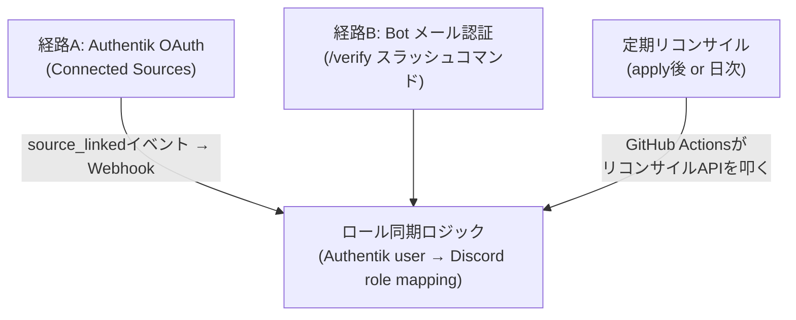
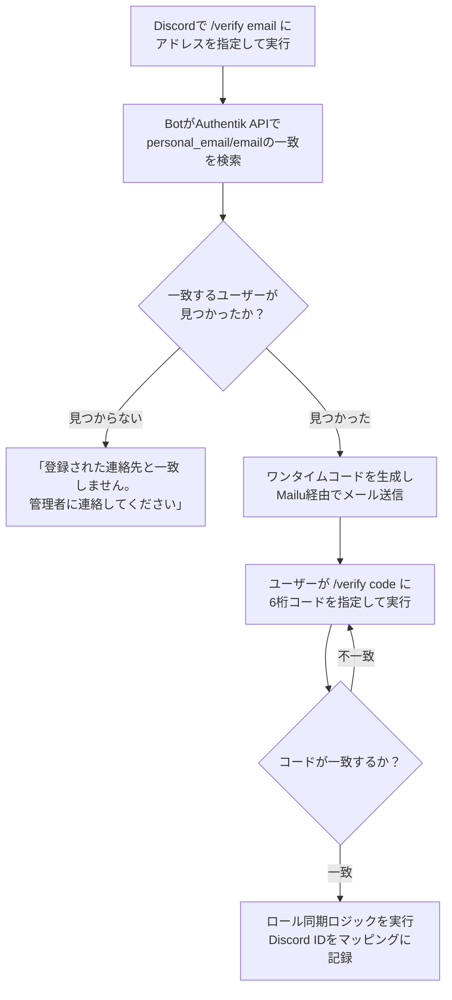
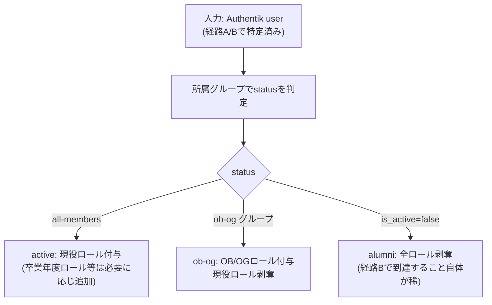

# Discord Bot 連携

`02-membership-lifecycle.md` / `forms/03-contact-info.md` を前提とします。

---

## 目的

Discord サーバー上のロール（現役／OB・OG／各種チャンネル閲覧権限）を、
Authentik 上のメンバーステータス（`active` / `ob-og` / `alumni`）と同期させます。
本人確認の手段として、要望通り2経路を用意します。

1. **Authentik 経由**（推奨・メイン経路）: Authentik の「Connected Sources」から Discord を OAuth 連携
2. **Bot 経由のメール認証**（代替経路）: Discord 上でメールアドレスを入力し、届いたコードで確認

どちらの経路でも、最終的には同じ「ロール同期」ロジックに合流します。

---

## 全体構成



「経路A」「経路B」はどちらも**入口が違うだけ**で、たどり着く先（ロール同期ロジック）は共通です。
これにより実装が二重化しません。

---

## 経路A: Authentik OAuth Source（メイン）

既存の GitHub 連携（`04-idp.md` の `provider_github_source.tf`）と全く同じパターンです。
Authentik は Discord を組み込みの OAuth Source タイプとしてサポートしています。

**`discord_oauth_client_id` / `discord_oauth_client_secret` 変数は実装済み**です
（`terraform/platform/idp/variables.tf`、`github_oauth_client_id`/`secret` と同じ default=""
パターン）。CI（`.github/workflows/apply.yml`）にも `TF_VAR_discord_oauth_client_id` /
`TF_VAR_discord_oauth_client_secret`（GitHub リポジトリ Secrets の `DISCORD_OAUTH_CLIENT_ID` /
`DISCORD_OAUTH_CLIENT_SECRET` から供給）の配線を追加済みです。ローカル（act）では
`local/.secrets`（`local/.secrets.example` にテンプレート追加済み）の
`TF_VAR_discord_oauth_client_id` / `TF_VAR_discord_oauth_client_secret` に値を入れます。
**未実装なのは下記の `authentik_source_oauth "discord"` リソース本体のみ**です。

```hcl
# terraform/platform/idp/provider_discord_source.tf（新規・未実装。
# 実際の provider_github_source.tf と同じく count で未設定時は作成しないパターンに揃える）
resource "authentik_source_oauth" "discord" {
  count = var.discord_oauth_client_id != "" ? 1 : 0

  name          = "Discord"
  slug          = "discord"
  provider_type = "discord"

  consumer_key    = var.discord_oauth_client_id
  consumer_secret = var.discord_oauth_client_secret

  # ログインには使わない（紐づけ専用。GitHub 連携と同じ方針）
  authentication_flow = null
  enrollment_flow      = null

  user_matching_mode = "identifier"
}
```

連携すると `source_linked` イベントが発火します。既存の GitHub 連携用 Webhook
（`notifications/transports.tf` の `github_link_webhook` 相当）と同じ仕組みを Discord にも展開し、
Discord のユーザー ID を Bot が受け取れるようにします。

### Discord Developer Portal の管理主体

この Discord OAuth アプリケーションは、以下の Discord Developer Portal チームで管理します。

<https://discord.com/developers/teams/1358051551310123291/information>

サークルの Admin アカウントでアクセスできます。`discord_oauth_client_id` /
`discord_oauth_client_secret`（Terraform variable）はこのチーム配下で発行したアプリケーションの
OAuth2 認証情報を使います。

### OAuth2 で設定すべき権限（スコープ）とリダイレクト URL

**用途がアカウント連携のみ**（ログインには使わない、「経路A」参照）なので、
Discord Developer Portal の OAuth2 設定で要求するスコープは最小限で足ります。

- **スコープ**: `identify` のみで十分です（Discord のユーザー ID・ユーザー名を取得できれば、
  ロール同期には必要十分なため）。メールアドレスは Discord 側からではなく
  `forms/03-contact-info.md` の `personal_email` を使うため、`email` スコープは不要です。
  Terraform 側では `authentik_source_oauth.additional_scopes` で追加スコープを指定できますが、
  `provider_type = "discord"` の組み込み既定スコープで `identify` は含まれるはずです
  （既定スコープの正確な内訳は Provider ドキュメントだけでは確認できないため、
  実装時に Authentik が実際に Discord へ投げる authorize URL を確認してください）。

- **リダイレクト URL（ローカル版）**: `authentik_source_oauth` リソースには
  Read-only の `callback_uri` 属性があり、これが Discord Developer Portal の
  「OAuth2 → Redirects」に登録すべき正確な URL です。**推測で決め打ちせず、
  一度 Terraform でリソースを作ってから `output` で確認するのが確実**です。

  ```hcl
  output "discord_source_callback_uri" {
    value = authentik_source_oauth.discord[0].callback_uri
  }
  ```

  参考までに、Authentik の OAuth Source コールバック URL は一般的に
  `{authentik_url}/source/oauth/callback/{slug}/` という形式です。ローカル環境
  （`local/authentik/` の docker compose、`http://localhost:9000`）であれば
  `http://localhost:9000/source/oauth/callback/discord/` になる**はず**ですが、
  これは記憶に基づく一般的なパターンであり、上記の `output` で必ず実際の値を確認してください。

- 本番環境用のリダイレクト URL は、Authentik 本番インスタンスの URL に対して同様に
  `output` で取得し、別途 Discord Developer Portal に追加登録します
  （Discord は1アプリに複数リダイレクト URL を登録できるため、ローカル・本番を両方登録して構いません）。

```yaml
# .github/workflows/sync-discord-ids.yml（新規・未実装。sync-github-usernames.yml と同構成）
on:
  repository_dispatch:
    types: [authentik-source-linked, authentik-source-unlinked]
    # payload.source == "discord" のものだけを処理
```

Discord ユーザー ID はそれ単体では機密性が低い（GitHub username と同程度の公開情報）ですが、
`lcn_xxxxxx` という内部 ID と紐づけて保存する以上、`02-membership-lifecycle.md` の
「卒業後の匿名化」方針の対象に含めます。`active` の間は既存の `auto-gen-github-usernames.yaml`
と同じ非 PII・Bot 書き込み・平文パターン（`auto-gen-discord-ids.yaml` にフラットに追記）で構いませんが、
`ob-og` / `alumni` へ移動したメンバーのエントリは、そのフラットファイルから削除し
コホートフォルダ側の `auto-gen-discord-ids.yaml.enc` へ Bot が移し替えます
（詳細は `02-membership-lifecycle.md` の「卒業後の匿名化」参照）。

```yaml
# terraform/platform/members/auto-gen-discord-ids.yaml（active のメンバーのみ・新規・未実装）
lcn_7f3a9b2c5e1d: "123456789012345678"  # Discord snowflake ID
```

この ID が確定した時点で、Bot（後述のロール同期ロジック）が
Discord サーバー上の実際のロールを付与します。

**制約**: `alumni`（`is_active=false`）になったメンバーは Authentik にログインできないため、
経路Aでは連携できません。卒業前・OB/OG のうちに連携しておく必要があります。

---

## 経路B: Bot 経由のメール認証（代替）

Authentik へのログインが使えない場合（`alumni` になった後、または OAuth 連携の UX を避けたい場合）向けの、
Discord 上で完結する代替経路です。



**この経路が機能する前提条件**: `forms/03-contact-info.md` の連絡先登録フォームで
`personal_email` を事前に登録していること。大学メールアドレスでの照合も一応可能ですが、
卒業後は本人がそのメールを読めなくなっている可能性が高く、実用上は
「在学中・OB/OG 期間中に個人メールを登録しておいてもらう」ことが前提になります。
これが `forms/03-contact-info.md` を先に設計した理由でもあります。

Bot は Authentik の PII を直接読むわけではなく、**スコープを絞った API トークンで
`attributes.personal_email` の一致検索と `email` フィールドの読み取りだけ**を行います。
Git 上の SOPS 暗号化ファイルには一切アクセスしません（`forms/03-contact-info.md` 参照）。

一致したユーザーが見つかった後、`auto-gen-discord-ids.yaml`（または `ob-og`/`alumni` の場合は
`auto-gen-discord-ids.yaml.enc`）へ記録する際のキーは、その Authentik user の
`attributes.lcn_id`（`02-membership-lifecycle.md` の「重要な訂正」参照）を読み取って使います。
以前は `{lcn_xxxxxx}@linuxclub.example` という club alias の email から逆算する想定でしたが、
`ob-og` は email を個人メールへ書き換えるためこの逆算ができなくなり、`attributes.lcn_id` を
明示的に持たせる設計に変更しました。

---

## ロール同期ロジック（共通）



### いつ実行されるか

- 経路A/Bでの初回連携・認証時（即時）
- `terraform apply` 後（`members.yaml` のフォルダ移動が反映されたタイミングで、
  Discord 側のロールが古いままにならないよう、GitHub Actions の apply ワークフローの
  最後に Bot のリコンサイル API を呼ぶステップを追加する）

---

## ホスティングについて（この設計書のスコープ外）

Discord Bot 自体は常時稼働のプロセスが必要です（スラッシュコマンドを受けるため）。
kind クラスター上に置くか、別途軽量なサーバーレス/コンテナ環境を用意するかは
インフラ配置の問題であり、このドキュメントでは扱いません。実装フェーズで別途決めます。

---

## 未決事項（要相談）

- Discord OAuth の `client_id` / `client_secret` の発行・管理主体
- Bot のホスティング先（上記）
- OTP コードの有効期限・再送制限（ブルートフォース対策）
- `alumni` になったメンバーが経路Bで認証できた場合、Discord 上でどこまでロールを残すか
  （`02` のアクセス権限マトリクスは「alumni はロール剥奪」としているが、
  OB/OG 相当のロールを個別事情で残したいケースが出た場合の運用ルール）
- リコンサイルの実行タイミング（apply 後の即時実行のみで十分か、日次バッチも併用するか）
