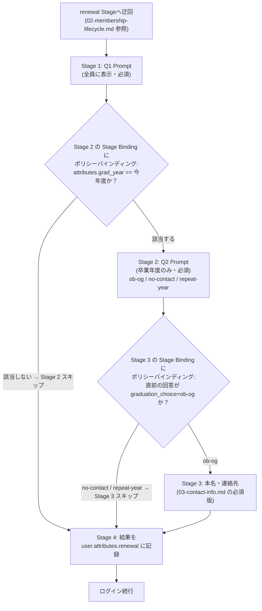

# 年次継続確認フォーム（Q1 / Q2）

**状態: 未実装・設計**。`02-membership-lifecycle.md` の「年次サイクル」で定義した
Q1（全員向け継続確認）・Q2（卒業年度向け OB/OG 分岐・留年届）を、実際にどう Terraform
リソースへ落とし込むかをフィールド単位で定義します。全体のいつ・なぜ・PR運用は
`02-membership-lifecycle.md` を参照してください。ここでは「フォームそのものの仕様」に絞ります。

---

## フィールド

| フィールド | 型 | 表示対象 | 選択肢 |
| --- | --- | --- | --- |
| `continue_next_year`（Q1） | `radio-button-group` | renewal 未回答の active 全員 | `continue` / `leave` |
| `graduation_choice`（Q2） | `radio-button-group` | 上記のうち卒業年度コホートのメンバーのみ | `ob-og` / `no-contact` / `repeat-year`（留年） |

`radio-button-group` は `authentik_stage_prompt_field.type` の許可値に含まれており
（Provider スキーマで確認済み）、実装可能です。

Q2 で `ob-og` を選んだ場合、送信直後に
[03-contact-info.md](03-contact-info.md) の必須版フォームへそのまま連結します。

### `repeat-year`（留年届）について

Q2 が「卒業年度コホート（`attributes.grad_year == 今年度`）のメンバーにだけ表示される」
という設計だったため、**実際には卒業せず留年する人にも Q2 が表示されてしまう**、
という抜けが元の設計にありました。「OB/OGとして残る」でも「連絡不要（≒卒業して完全退会）」
でもない、**「今年は卒業しない」という第3の選択肢**として `repeat-year` を追加します。

- `active` のまま（フォルダを `alumni`/`ob-og` へ移さない）
- 連絡先 Stage（`03-contact-info.md`）へは進まない（`no-contact` と同じ分岐）
- Bot が提案する PR の内容が他の2択と異なり、**`active/grad-<今年度>/` → `active/grad-<来年度>/`
  へのフォルダ移動**になる（`ob-og`/`alumni` フォルダへは移動しない）

Authentik には「申請 → 承認」を native にサポートする機能は **OSS 版には無い**ことを確認済みです
（`authentik_policy_event_matcher.model` の許可値に `authentik_lifecycle.review` 等が
存在するのは確認できましたが、`authentik.enterprise.lifecycle` という Enterprise 専用の
名前空間に属しており、Terraform で作成・管理できるリソースとしても提供されていません）。
留年届もこれまでの Q1/Q2 と同じ「Bot が PR を提案し、管理者が GitHub 上で承認する」という
仕組みでそのまま代替できるため、Authentik 側に新しい機能追加は不要です。

### `grad_year`（卒業年度）を内部属性として持つ

Q2 を「今年卒業する人だけに出す」ためには、各メンバーの卒業予定年度をどこかに
持っておく必要があります。**`attributes.grad_year`（整数）を Authentik user attribute として
持たせ、値は「現在どのコホートフォルダに入っているか」から Terraform apply のたびに
再計算します**（`terraform/platform/members/authentik_users.tf` の
`resource "authentik_user" "members"` にある既存の `attributes = jsonencode({...})` に
`grad_year = <その人が今いるコホートフォルダの年度>` を追加で渡す。
`terraform/modules/authentik-user` という汎用モジュールは存在しない）。

> **訂正**: 当初「`grad_year` はフォルダ移動があっても変わらない不変の履歴データ」と
> 書いていましたが、これは誤りでした。留年届（`repeat-year`）は「`active/grad-<今年度>/` →
> `active/grad-<来年度>/` というフォルダ移動によって `grad_year` を進める」ことで実現するため、
> `grad_year` は**現在のコホートフォルダをそのまま映す可変値**である必要があります。
> フォルダ移動 + `terraform apply` のたびに `attributes.grad_year` も自動的に再計算される
> （`resource "authentik_user" "members"` の `lifecycle.ignore_changes` に `attributes` は
> 含まれていないため、apply のたびに再計算・更新される）ため、留年処理そのものに
> 追加の Bot ロジックは不要で、他のフォルダ移動と全く同じ扱いで済みます。

理由（ポリシー式の書きやすさについては変更なし）:

- ポリシー式が `attributes.get("cohort") == f"grad-{YEAR}"` のような文字列組み立てでなく
  `attributes.get("grad_year") == YEAR` という単純な整数比較で済む

---

## フロー構成



Bot が PR を提案する段階での分岐は `02-membership-lifecycle.md` の
「全パターンの遷移先」表（`repeat-year` の行を追加済み）を参照してください。

---

## Terraform 実装イメージ（未実装・設計のみ）

```hcl
# forms/annual_renewal.tf（イメージ。下記「実装前に検証必須」の通り、
# 独立 Flow ではなく LC-Cloud authorization flow への直接バインドになる可能性が高い。
# この resource "authentik_flow" ブロックごと不要になるかもしれない）

resource "authentik_flow" "annual_renewal" {
  name        = "Annual Renewal"
  slug        = "annual-renewal"
  title       = "継続確認"
  designation = "stage_configuration"  # ログイン中フローに挟み込む用途（要検証）
}

# Stage 1: Q1（全員）
resource "authentik_stage_prompt_field" "continue_next_year" {
  field_key = "continue_next_year"
  label     = "来年度も活動を継続しますか？"
  type      = "radio-button-group"
  # 選択肢は authentik_stage_prompt_field には無く、
  # Authentik UI 側では "choices" 相当を別途 JSON で持たせる実装が必要
  # (Provider スキーマに choices 引数は無いため、実装時に Authentik API/Blueprint
  #  側の対応状況を要確認 — 下記「未決事項」参照)
  required = true
  order    = 100
}

resource "authentik_stage_prompt" "q1" {
  name   = "renewal-q1"
  fields = [authentik_stage_prompt_field.continue_next_year.id]
}

resource "authentik_flow_stage_binding" "q1" {
  target = authentik_flow.annual_renewal.uuid
  stage  = authentik_stage_prompt.q1.id
  order  = 10
}

# Stage 2: Q2（卒業年度コホートのみ）
resource "authentik_policy_expression" "is_graduating_cohort" {
  name       = "renewal-is-graduating-cohort"
  expression = <<-PYTHON
    CURRENT_GRAD_YEAR = 2027  # 年次更新のたびに更新する運用変数
    return request.user.attributes.get("grad_year") == CURRENT_GRAD_YEAR
  PYTHON
}

resource "authentik_stage_prompt_field" "graduation_choice" {
  field_key = "graduation_choice"
  label     = "今年度で卒業しますか？（留年する場合は「留年する」を選択）"
  # 選択肢: ob-og（卒業してOB/OGとして関わる）/ no-contact（卒業して連絡不要）/
  #         repeat-year（留年するので卒業しない）
  type      = "radio-button-group"
  required  = true
  order     = 100
}

resource "authentik_stage_prompt" "q2" {
  name   = "renewal-q2"
  fields = [authentik_stage_prompt_field.graduation_choice.id]
}

resource "authentik_flow_stage_binding" "q2" {
  target = authentik_flow.annual_renewal.uuid
  stage  = authentik_stage_prompt.q2.id
  order  = 20
}

resource "authentik_policy_binding" "q2_gate" {
  target = authentik_flow_stage_binding.q2.id
  policy = authentik_policy_expression.is_graduating_cohort.id
  order  = 0
}

# Stage 3: 本名・連絡先（Q2 で ob-og を選んだ場合のみ） — forms/03-contact-info.md 参照
resource "authentik_policy_expression" "chose_ob_og" {
  name       = "renewal-chose-ob-og"
  expression = <<-PYTHON
    return request.context.get("prompt_data", {}).get("graduation_choice") == "ob-og"
  PYTHON
}

# (Stage 3 本体・Stage Binding・Policy Binding は 03-contact-info.md 側で定義)

# Stage 4: 回答を user attribute に記録
resource "authentik_stage_user_write" "record_renewal" {
  name               = "renewal-record"
  user_creation_mode = "never_create"  # 既存ユーザーの更新のみ。新規作成しない
}

resource "authentik_flow_stage_binding" "record" {
  target = authentik_flow.annual_renewal.uuid
  stage  = authentik_stage_user_write.record_renewal.id
  order  = 40
}
```

---

## 実機検証で解決済み

以下はローカル Authentik への実際の apply・Flow Executor API 経由の実行で確認済みです。

- **フロー全体の骨格**: `annual_renewal` という独立 Flow（`designation = "stage_configuration"`）に
  Q1/Q2/連絡先/記録の Stage を並べる構成で、実際に作成・実行できることを確認済み。
  Flow を直接 URL（`/if/flow/annual-renewal/`）で開けば動作する
- **`radio-button-group` の選択肢**: `choices` 引数は存在しないが、`placeholder_expression = true` +
  `placeholder` を Python 式（選択肢のリストを `return`）にする方式で実現できることを確認済み
  （実ソース `authentik/stages/prompt/models.py` の `get_choices` で仕組みを特定し、
  実際に Flow Executor API のレスポンスで `choices` が正しく返ることも確認）
- **後続ステージのポリシーからの `prompt_data` 参照**: `field_key = "attributes.xxx"` は
  `prompt_data` 上で `{"attributes": {"xxx": ...}}` という**ネストした辞書**になることを実機で確認済み。
  また `chose_ob_og` のように前段ステージの回答を見るポリシーは、`evaluate_on_plan = false` +
  `re_evaluate_policies = true` の組み合わせが必要（デフォルトのプラン時一発評価だと
  前段の回答がまだ存在せず常に False になるバグを実際に踏んで修正済み。
  `authentik/flows/planner.py` / `markers.py` で仕組みを確認）
- **`attributes.xxx` の user_write への反映**: `authentik/stages/user_write/stage.py` の
  `update_user` で、`prompt_data` の `attributes` キー（辞書ごとマージ）と
  `attributes.xxx` キー（ネストパスへの個別書き込み）の両方が処理されることを確認済み

## 未解決（要実装判断）

- **ログイン中への自動割り込み配線**: 上記はすべて「Flow を直接開けば動く」ことの確認であり、
  「ログインのたびに自動でこの Flow へ迂回させる」配線はまだ実装していない。
  `stage_configuration` designation は通常 MFA 未設定時の誘導のように特定ステージの
  `configure_flow` ポインタ経由で呼ばれるものであり、今回のような用途に使えるかは未確認。
  より確実なのは、LC-Cloud の authorization flow に Q1〜記録の Stage を直接バインドし
  `needs_renewal` ポリシーでゲートする（独立 Flow を使わない）構成に組み直すこと
- Q1 で「継続しない」を選んだ場合の即時確認（本当に離脱してよいかの再確認ダイアログ等）は
  今回スコープ外
