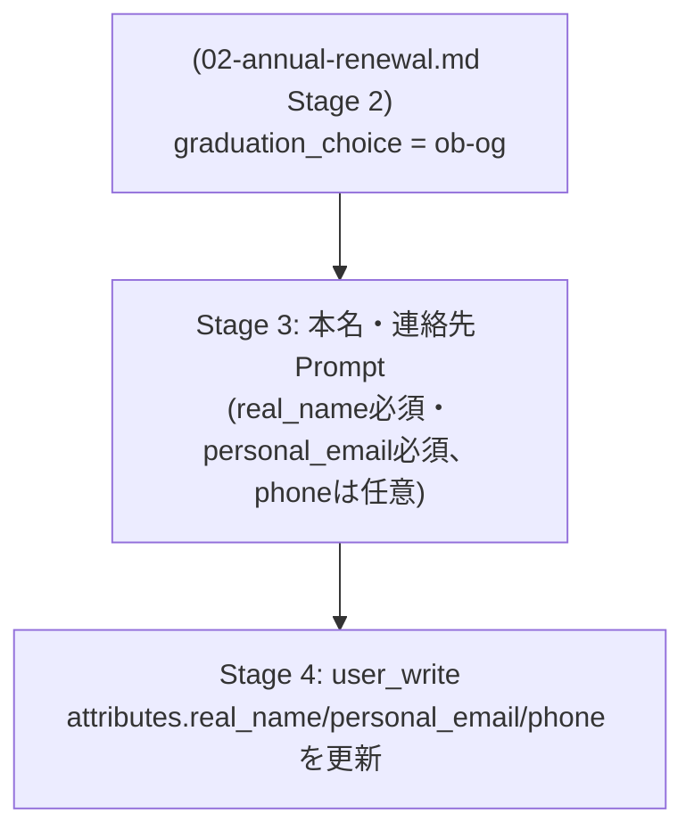

# 本名・個人連絡先登録フォーム

**状態: 文脈B（下表）は実装済み・実機検証済み**（`terraform/platform/idp/annual_renewal.tf`
の Stage 3 として）。**文脈A（プロフィール画面からの任意登録）は未実装**——独立した Flow は
作られておらず、`annual_renewal.tf` にも自分のプロフィール画面からのリンク導線は無い。
卒業後も連絡が取れるよう、本名・個人メールアドレス・電話番号を本人に自己申告してもらう
フォームです。2つの利用文脈を想定しています。

| 文脈 | 呼び出し元 | 必須度 | 実装状況 |
| --- | --- | --- | --- |
| A. 任意登録（いつでも） | Authentik 自分のプロフィール画面からのリンク | 全フィールド任意 | 未実装 |
| B. OB/OG 確定時 | `02-annual-renewal.md` の Q2 で `graduation_choice = ob-og` を選んだ直後 | 本名・**個人メールアドレスは必須**、電話番号は任意 | 実装済み・実機検証済み |

`ob-og` と判定するための最低条件が「卒業前に大学ドメイン以外の個人メールを登録していること」です。
電話番号はあくまで任意の補助的な連絡手段という位置づけです。

同じフィールド定義を2つの `authentik_stage_prompt` で使い分け、
`validation_policies` の有無で必須度を切り替えます（フィールド自体を共有はできず、
Stage ごとに Field リソースを分ける必要があります。Field は Stage 間で再利用できる設計ですが、
`required` はフィールド自体の属性のため、文脈Aと文脈Bで別の `required` 値を持たせるには
別インスタンスの Field が必要です）。

---

## データの置き場所: Authentik のみ（Git/Terraform には置かない）

`03-member-management.md` の PII 分類表にある

> パスワード・MFA シークレット｜機密｜Authentik が保持。Terraform では扱わない

と同じパターンを採用します。本名・個人メール・電話番号は Authentik User の
`attributes`（`attributes.real_name` / `attributes.personal_email` / `attributes.phone`）として
保持し、Git・Terraform State には一切出しません。理由は3点です。

1. 本人が自己申告・自己更新するデータであり、管理者が入会時に一度だけ書く
   `members_secrets.yaml.enc` とは更新頻度・更新者が異なる。
2. Discord Bot（`../04-discord-integration.md`）がメール照合に使う際、
   Git 上の SOPS 暗号化ファイルを復号する権限を Bot に持たせずに済む
   （スコープを絞った Authentik API トークンで読み取るだけで完結する）。
3. 既存の `student_id` も Authentik user attribute として渡す実装が既にあり、precedent がある。

> `03-member-management.md` の PII 分類表への追記案:
>
> | データ | 分類 | 管理方法 |
> |---|---|---|
> | 本名・個人メールアドレス・電話番号 | PII | Authentik が保持。Terraform/Git では扱わない。本人が自己入力・自己更新 |

`alumni` へ移動したメンバーのこれらの属性は、`02-membership-lifecycle.md` の方針に従い
削除します（「連絡不要」という意思表示と矛盾するデータを持ち続けないため）。

---

## フィールド

| フィールド | `field_key` | 型 | 文脈Aでの必須 | 文脈Bでの必須 |
| --- | --- | --- | --- | --- |
| 本名 | `real_name` | `text` | 任意 | ✅ 必須 |
| 個人メールアドレス | `personal_email` | `email` | 任意 | ✅ 必須 |
| 電話番号 | `phone` | `text` | 任意 | 任意（文脈Aと同じ） |

`type = "email"` は `authentik_stage_prompt_field.type` の許可値に含まれており
（Provider スキーマで確認済み）、基本的なメール形式チェックが自動で入ります。
電話番号用の専用型は無いため `text` を使います。

### バリデーション: 大学ドメインの拒否・電話番号の形式

`required = true` だけでは「大学メール以外」を保証できないため、
`authentik_stage_prompt.validation_policies` に2本のポリシーを追加します
（「メール・電話いずれか1つ以上必須」という OR 条件は不要になりましたが、
ステージ全体を検証する `validation_policies` の仕組み自体は別の目的で引き続き使います）。

**大学ドメイン拒否**（`personal_email` が `@edu.teu.ac.jp` で終わっていないか）:

```hcl
resource "authentik_policy_expression" "personal_email_not_university" {
  name       = "contact-info-reject-university-domain"
  expression = <<-PYTHON
    email = request.context.get("prompt_data", {}).get("personal_email", "")
    if email.lower().endswith("@edu.teu.ac.jp"):
      ak_message("大学のメールアドレスではなく、卒業後も使える個人のメールアドレスを入力してください")
      return False
    return True
  PYTHON
}
```

**電話番号の形式**（任意フィールドだが、入力された場合のみ検証）:
日本国内番号（`0` から始まる10〜11桁）をデフォルトとし、海外番号を書きたい場合は
`+81` のように `+` と国番号から始める形式を必須にします。

```hcl
resource "authentik_policy_expression" "phone_format" {
  name       = "contact-info-phone-format"
  expression = <<-PYTHON
    import re
    phone = request.context.get("prompt_data", {}).get("phone", "")
    if not phone:
      return True  # 任意フィールドなので未入力は許可

    digits = phone.replace("-", "").replace(" ", "")
    if digits.startswith("+"):
      if not re.fullmatch(r"\+[1-9]\d{7,14}", digits):
        ak_message("海外の電話番号は + と国番号から入力してください（例: +81901234567）")
        return False
    else:
      if not re.fullmatch(r"0\d{9,10}", digits):
        ak_message("電話番号は日本国内形式（0X0-XXXX-XXXX）か、+81 のような国際形式で入力してください")
        return False
    return True
  PYTHON
}
```

両方とも `authentik_stage_prompt.contact_info_required` の `validation_policies` に
リストで渡します（`validation_policies = [authentik_policy_expression.personal_email_not_university.id, authentik_policy_expression.phone_format.id]`）。
`authentik_stage_prompt.validation_policies` が複数ポリシーをリストで受け取れることは
Provider スキーマで確認済みです（`List of String`）。

---

## フロー構成（文脈B: Q2 から連結される場合）



文脈A（プロフィールからいつでも）は、同じフィールド定義で `required = false` の
別ステージを持つ、単独の小さな Flow（designation は enrollment 同様の設定で良い）として実装します。

---

## Terraform 実装イメージ（文脈B・未実装・設計のみ）

```hcl
# forms/contact_info.tf（イメージ。02-annual-renewal.md の Stage 3 に相当）

resource "authentik_stage_prompt_field" "real_name_required" {
  field_key = "real_name"
  label     = "本名"
  type      = "text"
  required  = true
  order     = 100
}

resource "authentik_stage_prompt_field" "personal_email_required" {
  field_key = "personal_email"
  label     = "個人メールアドレス（大学メール以外）"
  type      = "email"
  required  = true
  order     = 200
}

resource "authentik_stage_prompt_field" "phone_optional" {
  field_key = "phone"
  label     = "電話番号（任意）"
  type      = "text"
  required  = false
  order     = 300
}

resource "authentik_stage_prompt" "contact_info_required" {
  name   = "contact-info-required"
  fields = [
    authentik_stage_prompt_field.real_name_required.id,
    authentik_stage_prompt_field.personal_email_required.id,
    authentik_stage_prompt_field.phone_optional.id,
  ]
  # 必須/任意は各フィールドの required で表現。
  # 大学ドメイン拒否・電話番号形式チェックはステージ全体の validation_policies で行う
  validation_policies = [
    authentik_policy_expression.personal_email_not_university.id,
    authentik_policy_expression.phone_format.id,
  ]
}

resource "authentik_flow_stage_binding" "contact_info" {
  target = authentik_flow.annual_renewal.uuid  # 02-annual-renewal.md 参照
  stage  = authentik_stage_prompt.contact_info_required.id
  order  = 30
}

resource "authentik_policy_binding" "contact_info_gate" {
  target = authentik_flow_stage_binding.contact_info.id
  policy = authentik_policy_expression.chose_ob_og.id  # 02-annual-renewal.md で定義
  order  = 0
}
```

`ob-og` への遷移時に Authentik User の `email` フィールド自体も
`personal_email` の値に書き換える処理（`02-membership-lifecycle.md` の
「`ob-og` の実像」参照）が必要です。**`authentik_stage_user_write` の Terraform スキーマには
`attributes` や `email` を直接指定する引数は存在しません**が、これは Terraform 側の設定ではなく
Authentik 本体のランタイム挙動で処理される仕組みだと判明しました。ローカル実機で
`user_write` の実ソース（`stages/user_write/stage.py` の `update_user`）を確認したところ、
直前の Prompt Stage が送信した `prompt_data` を1キーずつ処理し、
`field_key = "attributes.xxx"` は `user.attributes` のネストしたパスへ、
`field_key = "email"` のように User モデルが実際に持つ属性名と一致するキーは
`setattr(user, key, value)` で直接書き込む、という2系統の処理が確認できました。
つまり `personal_email` フィールドとは別に `field_key = "email"` の Prompt Field を
用意すればそのまま `email` を書き換えられます（Webhook 経由の Bot フォールバックは不要）。

---

## 未決事項（要相談・要検証）

- 登録済みメールアドレスの検証（確認リンクを送るか、未検証のまま信用するか）
  — Discord Bot のメール認証（`../04-discord-integration.md`）の信頼性に直結する
- 文脈A（任意登録）と文脈B（OB/OG確定時必須）でフィールドの `required` を分けるために
  Field リソースを2セット持つのは冗長なため、実装時に共通化できないか再検討
