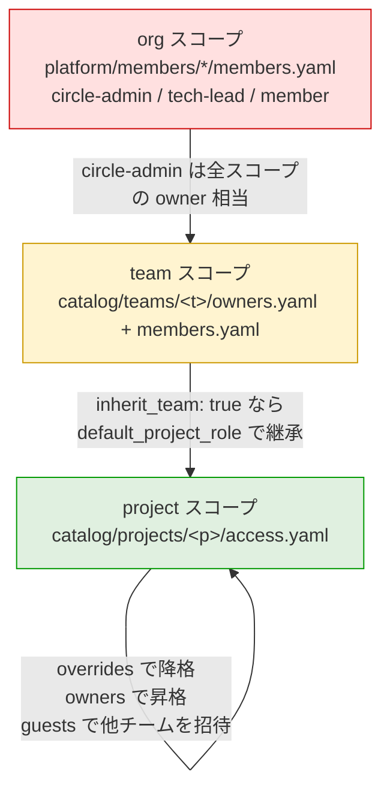
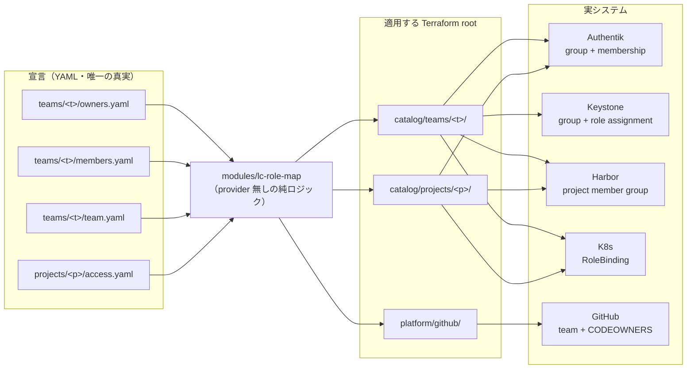

# チーム・プロジェクト権限管理（RBAC）

`10-roles-and-permissions.md` が扱うのは「**リポジトリ上で誰が何を承認できるか**」
（GitHub Teams・CODEOWNERS・Branch Protection）です。
本ドキュメントが扱うのはその先、「**実リソース上で誰が何を触れるか**」
（Authentik グループ・Keystone ロール・Harbor・K8s RBAC）です。

---

## 現状の穴

Phase 4 時点で `catalog/teams/<team>/` が作るのは
Authentik Group・Keystone project・クォータだけで、**そこに人が紐づいていません**。

- `catalog/teams/_template/` に `members.yaml` が無い
  （`02-repository-structure.md` の構成図には登場するが未実装）
- Keystone の `openstack_identity_role_assignment_v3` は
  自動化アカウントにしか張られていない
  → **メンバーは自分のアカウントで Horizon にも OpenStack API にもアクセスできない**
- `catalog/projects/` にはメンバーの概念自体が無い
- Harbor はインスタンスの OIDC 設定のみ。プロジェクト単位の RBAC は未実装

つまり今は「チームは存在するが、チームに所属するという状態が
どのシステムにも存在しない」状態です。ここを埋めます。

---

## 設計の 3 原則

### 1. 権限はグループに張る。個人はグループに入るだけ

Keystone・Harbor・K8s のいずれもグループ／OIDC グループ単位の権限付与に対応しています。
個人単位でロールを張ると、人が増えるたびに全システムでリソースが増え、
退会時の取りこぼしが必ず発生します。

**Authentik グループを唯一の主体（subject）とし、各システムはそのグループに権限を張る。**
人の出入りは Authentik グループのメンバーシップ 1 箇所だけで完結します。

### 2. ロールの語彙は全チーム共通で閉じる

チームごとに独自ロール体系を許すと、

- 5 チームで 15 種類のロールが生まれ、誰も全体を把握できなくなる
- 抽象ロール → 各システムの実ロールへの写像が 15 通り必要になる
- 「このロールは権限昇格できないか」の検証が事実上不可能になる

ので**ロール名は増やしません**。柔軟性は後述の 2 つの安全な軸
（アドオン権限 `grants` とチームポリシー `team.yaml`）に逃がします。

### 3. 「権限を配る権限」は権限本体と別ファイルに置く

CODEOWNERS の粒度はファイル単位です。
owner の追加・削除だけを circle-admin 承認必須にしたい場合、
同じファイルの中に owner と member が混在していると表現できません。
そこで `owners.yaml` と `members.yaml` を分割します（後述）。

---

## ロール定義

全スコープ共通で 3 つだけです。

| ロール | 一言で | 典型的にできること |
| --- | --- | --- |
| `owner` | そのスコープの責任者 | member/viewer の増減・quota 申請・`workspaces/` の承認・Harbor 全権 |
| `member` | 普段作る人 | VM/PVC の作成、`workspaces/` へ PR、イメージ push |
| `viewer` | 見るだけの人 | Horizon・Harbor・ログの閲覧。承認権なし |

> `owner` は **2 人以上を必須**とします（CI で検証）。
> GitHub は PR 作成者自身の CODEOWNERS 承認をカウントしないため、
> 1 人だと自チームの PR を誰もマージできなくなります
> （`10-roles-and-permissions.md`「Tier 3 の自己承認問題」と同じ理由）。

---

## 抽象ロール → 各システムの写像

この表が実装の背骨です。1 箇所（`modules/lc-role-map`）にだけ持ちます。

### チームスコープ

| ロール | Authentik グループ | Keystone ロール | Harbor | K8s namespace | GitHub Team |
| --- | --- | --- | --- | --- | --- |
| `owner` | `team-<t>-owner` | `member` | `projectadmin` | `admin` | `<t>-lead`（push） |
| `member` | `team-<t>-member` | `member` | `developer` | `edit` | `<t>`（push） |
| `viewer` | `team-<t>-viewer` | `reader` | `guest` | `view` | なし |

### プロジェクトスコープ

| ロール | Authentik グループ | Harbor | K8s namespace | CODEOWNERS |
| --- | --- | --- | --- | --- |
| `owner` | `proj-<p>-owner` | `projectadmin` | `admin` | `catalog/projects/<p>/`・`workspaces/projects/<p>/` |
| `member` | `proj-<p>-member` | `developer` | `edit` | なし（PR のみ） |
| `viewer` | `proj-<p>-viewer` | `guest` | `view` | なし |

### この写像が「漏れる」ところ（重要）

抽象化は完全ではありません。**どこで漏れるかを明示しておくほうが安全**です。

- **Keystone のロールは実質 `admin` / `member` / `reader` の 3 つしかない。**
  したがって `owner` と `member` は **OpenStack API 上はまったく同じ権限**になります。
  `owner` の特別さは GitHub の承認権・Harbor・K8s・`members.yaml` の編集権で表現されます。
  OpenStack 側で owner だけに許したい操作（quota 変更など）は、そもそも
  `platform/` / `catalog/` への PR 経由でしか実行できない設計なので実害はありません。

- **プロジェクトスコープに Keystone の行が無い。**
  `catalog/projects/` は専用の Keystone project を作らず、
  所属チームの project 内に network を作ります（`catalog/projects/_template/lc_cloud.tf`）。
  つまり **同一チーム内のプロジェクト同士は Keystone レベルでは分離されていません**。
  実際の分離境界は Application Credential の `access_rules` と K8s namespace です。
  プロジェクトロールは「誰が `workspaces/` を承認できるか」「誰が Harbor に push できるか」
  「誰が K8s namespace を触れるか」を決めるものだ、と理解してください。

- **viewer に GitHub Team を割り当てない。**
  リポジトリは単一の monorepo で、Org メンバーは全員 read できるためです。

---

## 柔軟性をどこで出すか

「チームごとにある程度柔軟に」という要求は、
**ロールを増やす方向ではなく次の 2 軸**で満たします。どちらも上限は platform 側が固定するため、
チームが自分の権限を越えて拡張することはできません。

### 軸 1: アドオン権限（`grants`）— 個人に足す

閉じた語彙の小さな権限を、ロールとは独立に個人へ付与します。
「この人だけ請求を見られる」「この人だけ Harbor の retention を触れる」を
新ロールを作らずに表現できます。

| grant | 効果 |
| --- | --- |
| `billing-view` | 請求アカウントのコスト閲覧（CloudKitty / Middleware API） |
| `billing-request` | quota・予算変更 PR の提出者になれる |
| `harbor-admin` | Harbor project のみ `projectadmin` へ昇格 |
| `k8s-exec` | K8s Pod への `exec` / ログ閲覧（Middleware API 側で判定） |
| `secret-admin` | `lc-k8s-app` の Secret を読み書きできる |

語彙の追加は `platform/` への PR（circle-admin 承認）でのみ行えます。

### 軸 2: チームポリシー（`team.yaml`）— チーム単位の運用ルール

個人ではなくチームの運用方針を宣言します。

| キー | 取りうる値 | 効果 |
| --- | --- | --- |
| `workspace_approvals` | `1` / `2` | `workspaces/` のマージに必要な承認数 |
| `allow_member_self_approve` | `true` / `false` | member が自分の `workspaces/` PR を通せるか |
| `allow_member_create_project` | `true` / `false` | member が `catalog/projects/` に PR を出せるか |
| `default_project_role` | `member` / `viewer` | チームメンバーがプロジェクトへ継承される既定ロール |
| `harbor` | `enabled` / `disabled` | Harbor project を払い出すか |

「厳しくする方向」は自由、「緩くする方向」は platform が定めた上限まで、という
一方向の設計にしておくと、チームに委譲しても全体の安全性が壊れません。

---

## スコープと継承



有効ロールの決定順序は次のとおりです。上にあるものが勝ちます。

1. `org` スコープの `circle-admin`（常に owner 相当）
1. `project` の `owners` / `overrides` / `guests`（明示指定）
1. `team` から継承した `default_project_role`
1. どれにも該当しなければ権限なし

**降格は書けるが、昇格はチーム owner の承認が要る**——という非対称を
CODEOWNERS のファイル分割で担保します（次節）。

### user スコープ（個人 project）

上の 3 スコープとは独立して、メンバー 1 人につき 1 つの個人 project があります。
チームに属さなくても自分の検証環境を持てるようにするためのもので、
継承関係を持ちません。

| | 値 |
| --- | --- |
| Keystone project | `user-<lcn_id>` |
| グループ | `user-<lcn_id>-owner` の 1 つだけ |
| 宣言ファイル | 無し。`platform/members/` の台帳から自動で作られる |
| 作られるもの | project・クォータ（`lc-micro`）・グループ・ロール付与 |

宣言ファイルを持たないのは、個人 project が台帳の関数だからです。
`active` なメンバー全員に 1 つずつ作られ、`ob-og` / `alumni` に移せば
project ごと消えます。「台帳の status を変えるだけで権限が外れる」という
性質がそのまま効きます。

ロールが `owner` だけなのは、1 人しか入らないためです。`owners.yaml` も
`members.yaml` も持ちません。したがってチームスコープにある
「owner は 2 人以上」の制約も適用されません。個人 project に関する PR は
`circle-admin` が代理承認します（`10-roles-and-permissions.md`）。

ネットワークと Application Credential は既定では作りません。人数分の
router interface を `int-router` に張るとそこが詰まること、Application Credential は
1 つあたり約 40 本の access rule を持つことが理由です。個人 project の VM は共有
`internal-net` に乗り、Neutron の default SG が境界になります。必要になった人が
個別に申請して足します。

グループ名のキーに username ではなく `lcn_id` を使うのは、username は本人が
enrollment 後に変更できるためです。username をキーにすると、改名した時点で
グループ名と実体がずれ、Keystone のロールが外れます。

---

## 宣言ファイルの構成

```text
terraform/catalog/teams/<team>/
├── team.yaml         # チームポリシー         → circle-admin 承認
├── owners.yaml       # owner のリスト         → circle-admin 承認
├── members.yaml      # member / viewer        → circle-admin または <t>-lead 承認
├── authentik.tf      # （既存）
├── lc_cloud.tf       # （既存）+ Keystone group / role assignment
├── harbor.tf         # （新）Harbor project + member group
└── access.tf         # （新）yaml を読んで写像を適用

terraform/catalog/projects/<project>/
├── access.yaml       # 継承 + 上書き + ゲスト  → circle-admin / <t>-lead / project owner
└── access.tf         # （新）
```

### `owners.yaml`

```yaml
# 承認者: circle-admin のみ（CODEOWNERS で強制）
owners:
  - id: lcn_9a2bb6e30171
  - id: lcn_1234abcd5678   # 2 人以上必須（CI 検証）
```

### `members.yaml`

```yaml
# 承認者: circle-admin または <team>-lead
members:
  - id: lcn_aaaabbbbcccc
    role: member
    grants: [billing-view]
  - id: lcn_ddddeeeeffff
    role: viewer
```

### `team.yaml`

```yaml
policy:
  workspace_approvals: 1
  allow_member_self_approve: false
  allow_member_create_project: true
  default_project_role: member
  harbor: enabled
```

### `projects/<project>/access.yaml`

```yaml
inherit_team: true

owners:
  - id: lcn_aaaabbbbcccc     # チームでは member でもプロジェクトでは owner にできる

overrides:
  - id: lcn_ddddeeeeffff
    role: viewer             # 継承した member から降格

guests:                      # 他チームからの参加
  - id: lcn_999988887777
    role: member
    until: "2027-03-31"
```

> **`until` を Terraform で評価しないこと。**
> Terraform 側で期限切れを判定すると、コードを変更していないのに
> ある日突然 plan に差分が出る（＝ CI が壊れる）ことになります。
> 期限は **CI が検出して失効 PR を自動起票**し、
> 実際の失効は「yaml から行を消す PR がマージされる」ことで起きる、という形にします。
> 権限の変化が必ず Git 履歴に残るという性質も維持できます。

---

## Terraform 実装への落とし方

`lcn_id` は `platform/members/` が持つ不変の識別子です。
各 root は**リポジトリ内の yaml ファイルを直接読みます**
（`terraform_remote_state` は使わない。既存方針と同じ）。



### 所属の書き込み口は 1 つに固定する（実装で判明した制約）

Authentik は `authentik_user.groups` と `authentik_group.users` の
**どちらからでも**所属を書けますが、API はどちらも「集合の丸ごと置き換え」です。
したがって `catalog/teams/` が `group.users` を書き、
`platform/members/` が `user.groups` を書くと、
2 つのスタックが apply のたびに互いの変更を消し合う**無限 drift** になります。

そこで役割を次のように分けます。

| スタック | 責務 |
| --- | --- |
| `catalog/teams/<t>/access.tf` | グループを作り、**グループに権限を張る** |
| `platform/members/team_memberships.tf` | **誰がそのグループに入るか**を書く |

宣言そのものは `catalog/teams/<t>/{owners,members}.yaml` にあり、
承認ゲートは CODEOWNERS がそのファイルに掛かります。
**apply するスタックが Tier 1 でも、変更を承認できる人は変わりません。**

この分割には副次的な利点があります。`platform/members/` は
`ob-og` / `alumni` になったメンバーのグループを空にするため、
**台帳の status を変えるだけで全チームの権限が確実に外れます**。

> **apply 順序の注意**: `platform/members/` はグループを名前で `data` 参照するため、
> 新チームは `catalog/teams/<t>/` を先に apply しておく必要があります。
> 新チーム作成とメンバー追加は別 PR に分けるか、CI で
> `catalog/teams/` → `platform/members/` の順に apply してください。

### `modules/lc-role-map`

provider を持たない純粋なロジックモジュールです。
抽象ロールを入れると各システムのネイティブロール名が返ります。
写像表がここ 1 箇所にしか無いことが重要です。

```hcl
# modules/lc-role-map/outputs.tf（イメージ）
output "keystone" {
  value = { owner = "member", member = "member", viewer = "reader" }
}

output "harbor" {
  value = { owner = "projectadmin", member = "developer", viewer = "guest" }
}

output "k8s" {
  value = { owner = "admin", member = "edit", viewer = "view" }
}
```

### Keystone 側（グループ経由）

Authentik は OIDC フェデレーションで Keystone に繋がっています（`[P2]`）。
フェデレーションユーザーはローカルユーザーとして存在しないため、
**ロールは Keystone グループに張り、フェデレーションマッピングが
Authentik のグループクレームを Keystone グループへ写します**。

```hcl
# catalog/teams/<t>/access.tf（イメージ）
resource "openstack_identity_group_v3" "role" {
  for_each = toset(["owner", "member", "viewer"])
  name     = "team-${var.team_name}-${each.key}"
}

resource "openstack_identity_role_assignment_v3" "team" {
  for_each   = openstack_identity_group_v3.role
  project_id = openstack_identity_project_v3.this.id
  group_id   = each.value.id
  role_id    = data.openstack_identity_role_v3.mapped[each.key].id
}
```

### Harbor 側

`harbor_project_member_group` は `type = "oidc"` で
OIDC グループ名を直接指定できます。個人単位のリソースは作りません。

### GitHub 側

`platform/github/` が全チームの yaml を `fileset` で走査し、
GitHub Team・そのメンバーシップ・CODEOWNERS を生成します。
`platform/members/` が既に yaml を読んで `github_membership` を作っているのと同じ形です。

---

## CI ガード

権限まわりは「apply が通る」だけでは不十分です。次を PR 時に検証します。

下表の ✅ は **Terraform の `precondition` として実装済み**で、
別途 CI スクリプトを用意しなくても `terraform plan` の時点で失敗します
（`catalog/teams/_template/access.tf` の `terraform_data.access_invariants`）。
CI スクリプトが要るのは、Terraform の外側の情報（PR の承認状況・日付）を見る項目だけです。

| チェック | 内容 | 実装 | 失敗時 |
| --- | --- | --- | --- |
| 失効整合性 | `platform/members/` で `ob-og` / `alumni` になった `lcn_id` が team の yaml に残っていないか | ✅ precondition | fail |
| 実在性 | yaml 中の `lcn_id` がメンバー台帳に存在するか | ✅ precondition | fail |
| owner 下限 | 各チームの `owners.yaml` が 2 人以上か | ✅ precondition | fail |
| 重複 | 同じ `lcn_id` が複数ロールで宣言されていないか | ✅ precondition | fail |
| ロール値 | `members.yaml` の `role` が `member` / `viewer` か（`owner` は `owners.yaml` のみ） | ✅ precondition | fail |
| grant 語彙 | `grants` が `modules/lc-role-map` の語彙に含まれるか | ✅ precondition | fail |
| 昇格経路 | `owners.yaml` / `team.yaml` の diff に circle-admin の承認があるか | CI（未実装） | fail |
| 期限切れ | `until` を過ぎた `guests` が残っていないか | CI（未実装） | 失効 PR を自動起票 |
| 棚卸し | 年次継続フロー（`annual_renewal.tf`）の Q1 完了後、更新されていない yaml | CI（未実装） | warning |

`catalog/teams/<t>/access.tf` がメンバー台帳（`platform/members/*/*/members.yaml`）を
**ファイルとして直接読む**ことで、失効整合性・実在性を plan 時点で検証しています。
state を跨がずファイルを読むのは、この repo の既存方針
（値は remote state ではなく明示的に橋渡しする）と同じ考え方です。

**失効整合性のチェックが最も価値があります。**
「卒業した人の権限が消えずに残る」はサークル運営で最も起きやすく、
かつ最も気づかれにくい事故です。`platform/members/` の 3 層モデル（active / ob-og / alumni）と
team/project の yaml を機械的に突き合わせることで、構造的に防げます。

---

## 実装ステップ

Phase 4（catalog）と Phase 5（modules）の間に挟まる位置づけです。
**ステップ 2 まででも「メンバーが自分のアカウントで OpenStack を触れる」という
現状できていないことが達成できます**（現在は human への role assignment が一切ありません）。

1. ✅ 語彙とスキーマの確定 — `modules/lc-role-map` + yaml スキーマ + `_template` 更新
1. ✅ Authentik グループ + Keystone グループ / role assignment（`catalog/teams/`）と
   所属の書き込み（`platform/members/team_memberships.tf`）
1. `platform/github/` を yaml 走査に変更 — Team メンバーシップ + CODEOWNERS 自動生成
1. Harbor project + member group（`catalog/teams/` / `catalog/projects/`）
1. K8s RoleBinding（`modules/kubernetes-namespace` を拡張）
1. project スコープ（`catalog/projects/<p>/access.yaml`）の実装 —
   ステップ 4・5 で初めて束ねる先ができるため、そこまで進めてから着手する
1. CI ガード（上表のうち precondition で表現できない 3 項目）

> **ステップ 1・2 の実装状況**: **エンドツーエンド検証済み（2026-09-06）**。
> ローカル開発環境（GCP DevStack + ローカル Authentik）に `rbac-test` という
> チームを実際に作成し、次を確認したうえで `terraform destroy` して削除した。
>
> - Keystone project・ロール別グループ 3 つ・role assignment 3 つ・クォータ 3 種、
>   Authentik の包括グループ + ロール別グループ 3 つが実際に作られること
> - **ロール写像が実 role ID に一致すること**（`owner`/`member` → `member`、
>   `viewer` → `reader`。実機の role ID と突き合わせて確認）
> - **再 plan が clean であること**（`authentik_group.users` を意図的に
>   管理しない判断が正しく、永久 drift が発生しないこと）
> - `platform/members/` が実 Authentik のグループを名前解決し、
>   各メンバーに「包括グループ + 自分のロールグループ」を割り当てること
> - precondition 6 種（owner 1 人・id 重複・`role: owner`・未定義 grant・
>   台帳外 id・**ob-og 化したメンバーの残存**）がすべて plan 時に発火すること
>
> **本番（Polaris / 本番 Authentik）への apply は未実施**です。
> 本番 Keystone に `reader` ロールが存在することの確認が必要です
> （DevStack には存在した。Ussuri 以降の既定ロールだが環境により未定義のことがある）。

---

## 検討したが採らなかった案

| 案 | 却下理由 |
| --- | --- |
| チームごとに独自ロールを定義できるようにする | ロール数がチーム数に比例して増え、写像・監査が破綻する。柔軟性は `grants` と `team.yaml` で足りる |
| ロールを 4 段階（`owner` / `maintainer` / `member` / `viewer`）にする | Keystone が `member` / `reader` しか持たないため maintainer と member の差が OpenStack 上に出ない。数十人規模のサークルでは 3 つで十分 |
| 個人単位で Keystone role assignment を張る | フェデレーションユーザーは Keystone にローカル実体を持たないため、そもそもユーザーにロールを張れない。個人 project でも本人だけが入るグループを作り、そこに張る |
| Authentik のロール／パーミッション機能を使う | Authentik 内部の管理権限を表現するものであり、Keystone や Harbor の権限とは無関係。写像先にならない |
| `until` を Terraform で評価して自動失効させる | コード無変更で plan に差分が出る。権限の変化が Git 履歴に残らなくなる |
| 権限を Middleware API の DB で持つ | Terraform / Git を唯一の真実とする本リポジトリの前提（`01-overview.md` 設計原則 5）と矛盾する |

---

> リポジトリ上の承認権限（GitHub Teams・CODEOWNERS・Branch Protection）は
> `10-roles-and-permissions.md`、Branch Protection の具体設定は `06-cicd.md` を参照してください。
