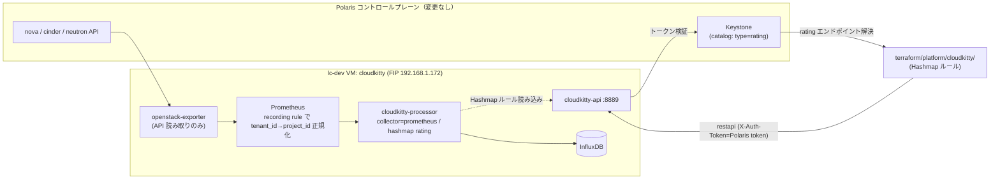

# cloudkitty-infra — Polaris 上の CloudKitty レーティング基盤

`terraform/platform/cloudkitty/`（Hashmap 課金ルールの IaC）が接続する先の
**CloudKitty 本体**を Polaris（実 OpenStack / Kolla-Ansible）に構築する。

- 配置先: OpenStack `lc-dev` プロジェクトの VM 1 台（`cloudkitty`）
- コントロールプレーン（lc-sv01〜03 の Kolla）には**一切変更を加えない**
- 構成物は `stack/`（docker compose 一式）。Terraform 化された VM プロビジョニングは
  未実装（`idp-infra` と同じ形にする follow-up）。現状は下記手順で手動構築する。

## アーキテクチャ



### なぜ Prometheus collector（Gnocchi ではない）か

Polaris(Kolla) は `enable_ceilometer = no`、nova / neutron の
`[oslo_messaging_notifications] driver = noop` で**通知バスが無い**。Ceilometer の
標準パイプライン（notification agent → Gnocchi）はコントロールプレーンを再設定しないと
何も集計できない。`openstack-exporter` は REST API を読むだけで完結し、
コントロールプレーンに触れずに済む。Hashmap ルール自体は collector 非依存なので、
将来 Gnocchi を入れられるなら戻せる（service 名 = metric の `alt_name` を合わせるだけ）。

## メトリクスと単価（documents/terraform/09-costs.md）

| CloudKitty service | Prometheus recording rule | 元メトリクス | 単価 |
|---|---|---|---|
| `vcpu` | `cloudkitty:vcpu:used` | `openstack_nova_limits_vcpus_used` | 1.000 Credit / vCPU-hour |
| `memory` | `cloudkitty:memory_gb:used` | `openstack_nova_limits_memory_used` / 1024 | 0.250 Credit / GB-hour |
| `volume` | `cloudkitty:volume_gb:used` | `openstack_cinder_limits_volume_used_gb` | 0.002 Credit / GB-hour |
| `floating_ip` | `cloudkitty:floating_ip:count` | `count(openstack_neutron_floating_ip)` | 0.500 Credit / IP-hour |

`period = 3600` なので qty はそのまま「その 1 時間の使用量」。`単価 × qty` = Credit/時。

## 前提（Polaris 側で用意したもの）

`local/polaris-access.md`（gitignore 済み）に認証情報。要点:

- `local/clouds.yaml` に `polaris-admin`（admin/password, lc-dev scope）、
  `polaris-admin-system`（system scope）を追加済み。
  admin ユーザーには `lc-dev` プロジェクトの `admin` ロールを付与済み
  （application credential は project 越境できないため）。
- keypair `ck-polaris`（秘密鍵 `local/polaris/ck_key`）
- security group `cloudkitty-sg`（22 / 8889 / 8041 / ICMP を 0.0.0.0/0 ← ラボ LAN 前提）
- VM `cloudkitty`（m1.medium / rocky-10 / boot-from-volume 30GB / lc-dev-net）
- Floating IP `192.168.1.172`
- Keystone カタログに `rating` サービス + endpoint（public/internal/admin）
  `http://192.168.1.172:8889` を登録済み

VM 再作成が必要な場合（要 `OS_CLIENT_CONFIG_FILE=local/clouds.yaml`）:

```bash
openstack --os-cloud polaris-admin server create \
  --flavor m1.medium --image rocky-10 --boot-from-volume 30 \
  --network lc-dev-net --security-group cloudkitty-sg --key-name ck-polaris \
  --wait cloudkitty
openstack --os-cloud polaris-admin floating ip create ext-net
openstack --os-cloud polaris-admin server add floating ip cloudkitty <FIP>
# rocky-10 は最小イメージで docker のカーネルモジュールが無い。初回のみ:
#   sudo dnf -y install docker-ce docker-compose-plugin
#   /etc/modules-load.d/docker.conf に overlay/br_netfilter/iptable_nat/xt_addrtype 等
#   を書いて reboot（詳細は stack/deploy.sh 冒頭コメントは無し。ここを参照）
```

カタログ登録（未登録なら）:

```bash
openstack --os-cloud polaris-admin-system service create --name cloudkitty rating
for i in public internal admin; do
  openstack --os-cloud polaris-admin-system endpoint create rating $i \
    http://192.168.1.172:8889 --region RegionOne
done
```

## デプロイ

```bash
cd terraform/platform/cloudkitty-infra/stack
cp .env.example .env                       # 値を編集（OS_ADMIN_PASSWORD 等）
cp openstack/clouds.yaml.example openstack/clouds.yaml   # password を入れる
# VM へ同期して実行
scp -i ../../../../local/polaris/ck_key -r . rocky@192.168.1.172:/opt/cloudkitty/stack/
ssh -i ../../../../local/polaris/ck_key rocky@192.168.1.172 \
  'cd /opt/cloudkitty/stack && sudo ./deploy.sh'
```

`deploy.sh` は cloudkitty.conf をレンダリング → `docker compose up -d` →
hashmap レーティングモジュールを enable する。

## レーティングルールの適用（terraform/platform/cloudkitty/）

```bash
cd terraform/platform/cloudkitty
export OS_CLIENT_CONFIG_FILE=$PWD/../../../local/clouds.yaml
export OS_CLOUD=polaris-openstack           # application credential（admin scope）
# S3(共有 state) を使わずローカル state で回す（*_override.tf は gitignore 済み）
printf 'terraform { backend "local" {} }\n' > backend_override.tf
terraform init -input=false
terraform apply -input=false
terraform plan  -input=false                # → No changes（drift 無し）を確認
```

## 動作確認

```bash
TOK=$(openstack --os-cloud polaris-openstack token issue -f value -c id)
FIP=192.168.1.172
# Hashmap ルール
curl -s http://$FIP:8889/v1/rating/module_config/hashmap/services  -H "X-Auth-Token: $TOK"
curl -s http://$FIP:8889/v1/rating/module_config/hashmap/mappings  -H "X-Auth-Token: $TOK"
# レーティング結果（1 period 経過後）
curl -s "http://$FIP:8889/v1/storage/dataframes?begin=$(date -u -d '2 hours ago' +%Y-%m-%dT%H:00:00)" \
  -H "X-Auth-Token: $TOK"
```

## 既知の制約・TODO

- **exporter は 2.0.0-alpha を使用**。1.7.0(最新 stable) / 1.8.0-alpha は cinder
  メトリクスが無い。alpha なので VPN / security-group 系エンドポイントに 404 の
  ERROR ログが出るが、必要なメトリクスの取得には影響しない。
- VM プロビジョニングを Terraform 化（`idp-infra` と同じ形）する。
- `local/clouds.yaml` の `polaris-admin` はパスワード直書き。将来は
  cloudkitty 専用のサービスユーザー + application credential に置き換える。
- object storage（RGW）導入時に metric と rule を追加する。
