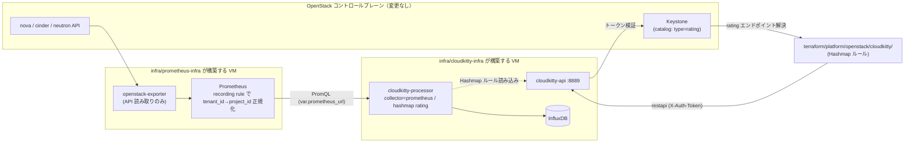

# terraform/platform/infra/cloudkitty-infra

`terraform/platform/openstack/cloudkitty/`（Hashmap 課金ルールの IaC）が接続する先の
**CloudKitty 本体** を単一 VM + Docker Compose で構築する root。
`terraform/platform/infra/idp-infra/` と同じ構成方針（cloud-init が Docker を入れ、
Terraform が生成した設定を丸ごと展開して起動する。手作業での VM ログイン・scp は不要）。

`idp-infra` が「Authentik をどこで動かすか」なら、これは「CloudKitty をどこで動かすか」。

## アーキテクチャ



Prometheus + openstack-exporter は `terraform/platform/infra/prometheus-infra/` で
**別 VM** として構築する（CloudKitty 専用にせず、他の監視用途にも再利用しやすくするため）。
CloudKitty 側は `var.prometheus_url` でその VM の Prometheus API を参照するだけで、
自分ではメトリクス収集を一切行わない。

### なぜ Prometheus collector（Gnocchi ではない）か

OpenStack のコントロールプレーンで Ceilometer の通知パイプラインが有効化されていない・
あるいはコントロールプレーンには手を入れたくない環境では、Ceilometer 経由の
Gnocchi collector は使えない。`openstack-exporter` は REST API を読むだけで完結し、
コントロールプレーンに一切触れずに済む。Hashmap ルール自体は collector 非依存なので、
将来 Gnocchi を使える環境が整えばそちらに切り替えられる（service 名 = metric の
`alt_name` を合わせるだけ）。

## メトリクスと単価（documents/terraform/09-costs.md）

| CloudKitty service | Prometheus recording rule | 元メトリクス | 単価 |
|---|---|---|---|
| `vcpu` | `cloudkitty:vcpu:used` | `openstack_nova_limits_vcpus_used` | 1.000 Credit / vCPU-hour |
| `memory` | `cloudkitty:memory_gb:used` | `openstack_nova_limits_memory_used` / 1024 | 0.250 Credit / GB-hour |
| `volume` | `cloudkitty:volume_gb:used` | `openstack_cinder_limits_volume_used_gb` | 0.002 Credit / GB-hour |
| `floating_ip` | `cloudkitty:floating_ip:count` | `count(openstack_neutron_floating_ip)` | 0.500 Credit / IP-hour |

`period = 3600` なので qty はそのまま「その 1 時間の使用量」。`単価 × qty` = Credit/時。
recording rule の定義は `infra/prometheus-infra/templates/cloud-init.yaml.tftpl` 参照。

## 前提

- `local/clouds.yaml` に対象プロジェクトへスコープされた cloud エントリ
  （既定 `polaris-admin`）。App credential は project 越境不可のため
  admin パスワード認証を使う想定（`idp-infra` と同じ理由）。
- `var.keystone_auth_url` / `var.os_admin_username` / `var.os_admin_password` は
  デフォルト値を置いていない（環境ごとに異なるため）。apply 時に明示的に渡す。
- `var.prometheus_url` は `infra/prometheus-infra/` を先に apply し、その
  `terraform output -raw prometheus_url` を渡す。

> **本番 Ceph RGW backend への適用時の注意**: この root の実機検証・移行
> （既存 VM の import 含む）は `backend_override.tf` によるローカル state で
> 実施した（本番 backend の認証情報がこの検証環境に無いため）。本番 backend
> 側の state はまだ空のまま。空の状態で CI から apply すると、既に import 済みの
> 実 VM とは別に**新規 VM を重複して作ってしまう**。本番運用に載せる前に、
> ローカルで作った state を本番 backend へ移す（`terraform state push` 等）こと。

## デプロイ

```bash
export OS_CLIENT_CONFIG_FILE="$(git rev-parse --show-toplevel)/local/clouds.yaml"
# MinIO backend（local/start.sh で起動済みなら）
export AWS_ENDPOINT_URL_S3=http://localhost:19000
export AWS_ACCESS_KEY_ID=minioadmin
export AWS_SECRET_ACCESS_KEY=minioadmin
export AWS_DEFAULT_REGION=us-east-1

cd terraform/platform/infra/prometheus-infra
terraform init && terraform apply \
  -var="keystone_auth_url=http://<host>:5000/v3" \
  -var="os_admin_password=<password>"
PROM_URL=$(terraform output -raw prometheus_url)

cd ../cloudkitty-infra
terraform init && terraform apply \
  -var="keystone_auth_url=http://<host>:5000/v3" \
  -var="os_admin_password=<password>" \
  -var="prometheus_url=$PROM_URL"

terraform output -raw cloudkitty_api_url   # → Keystone カタログ登録に使う
```

初回 apply 後、cloud-init が Docker pull → compose up し、hashmap レーティング
モジュールを enable するまで数分かかる。

```bash
FIP=$(terraform output -raw floating_ip)
ssh -i .ssh/cloudkitty rocky@$FIP 'cat /opt/cloudkitty/.bootstrapped; docker compose -f /opt/cloudkitty/docker-compose.yml ps'
curl -fsS http://$FIP:8889/ && echo OK
```

## Keystone カタログ登録

CloudKitty はスタンドアロン構成（Kolla 等のコントロールプレーンに組み込まない）のため、
`rating` サービスのカタログ登録は別途手動で行う（admin 権限が必要）:

```bash
openstack service create --name cloudkitty rating
for i in public internal admin; do
  openstack endpoint create rating $i "$(cd terraform/platform/infra/cloudkitty-infra && terraform output -raw cloudkitty_api_url)" \
    --region RegionOne
done
```

## レーティングルールの適用（terraform/platform/openstack/cloudkitty/）

```bash
cd terraform/platform/openstack/cloudkitty
export OS_CLIENT_CONFIG_FILE="$(git rev-parse --show-toplevel)/local/clouds.yaml"
export OS_CLOUD=<application credential のスコープ済み cloud 名>
terraform init && terraform apply
terraform plan   # → No changes（drift 無し）を確認
```

## 動作確認

```bash
TOK=$(openstack --os-cloud <cloud> token issue -f value -c id)
FIP=$(cd terraform/platform/infra/cloudkitty-infra && terraform output -raw floating_ip)
# Hashmap ルール
curl -s "http://$FIP:8889/v1/rating/module_config/hashmap/services"  -H "X-Auth-Token: $TOK"
curl -s "http://$FIP:8889/v1/rating/module_config/hashmap/mappings"  -H "X-Auth-Token: $TOK"
# レーティング結果（1 period 経過後）
curl -s "http://$FIP:8889/v1/storage/dataframes?begin=$(date -u -d '2 hours ago' +%Y-%m-%dT%H:00:00)" \
  -H "X-Auth-Token: $TOK"
```

## 既知の制約・TODO

- **exporter は 2.0.0-alpha を使用**（`infra/prometheus-infra` 側）。1.7.0(最新 stable) /
  1.8.0-alpha は cinder メトリクスが無い。alpha なので一部エンドポイントに 404 の
  ERROR ログが出るが、必要なメトリクスの取得には影響しない。
- `var.os_admin_password` はパスワード直書き。将来は cloudkitty 専用のサービス
  ユーザー + application credential に置き換える。
- object storage（RGW）導入時に metric と rule を追加する。

## 移行実績（2026-09-04）

過去に手動構築されていた VM（`deploy.sh` によるスタック同期方式、Prometheus/exporter
同居）は、新規 VM を作らず `terraform import` で本 root の管理下に移行済み
（実インフラへの変更なし。手順は `terraform import` の実行ログ参照・
`documents/terraform/16-implementation-phases.md` にも記録）。その後、
VM 上で稼働中のまま docker-compose.yml を書き換えて `openstack-exporter`/
`prometheus` サービスを停止・削除し、`cloudkitty.conf` の
`collector_prometheus.prometheus_url` を新設の `infra/prometheus-infra` VM へ
向け直した（cloudkitty-api/processor は無停止、InfluxDB のレーティング
データは無影響。旧 Prometheus の蓄積データのみ失われた）。

import 時に import では復元できなかった項目（`random_password.special`・
`network[].port`・`security_group_rule` の `description` が force-new 属性
であること）は idp-infra と同様の手順で解消済み。詳細は
`terraform/platform/infra/idp-infra/README.md`「ローカル state での動作確認」
節と同じ考え方。
