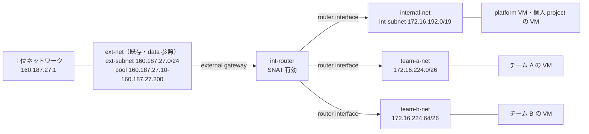

# terraform/platform/openstack/network/

LC-Cloud のネットワーク土台。外部サブネット（`ext-subnet`）・共有内部ネットワーク
（`internal-net` / `int-subnet`）・出口ルーター（`int-router`）・チームプロジェクト
専用 subnet を払い出すマスタープール（`lc-cloud-pool`）を管理する。

## 構成

チームプロジェクトは専用ネットワークを持ち、platform 自身の VM と個人プロジェクトの
VM は共有の `internal-net` に乗る。どちらも出口は `int-router` 1台。

`team-*-net` は `catalog/projects/<name>/` が作る。この root は箱（subnetpool と
ルーター）だけを用意する。

| ファイル | 内容 |
| --- | --- |
| `external_network.tf` | `ext-net` の data 参照、`ext-subnet`、`access_as_external` RBAC ポリシー |
| `internal_network.tf` | `internal-net`・`int-subnet`・`int-router`・router interface、`access_as_shared` RBAC ポリシー |
| `subnetpool.tf` | `lc-cloud-pool`（`172.16.224.0/19` から /26 を自動採番） |

DNS はどちらのサブネットも `1.1.1.1`（`var.dns_nameservers`）。`ext-subnet` は
外部ネットワークなので DHCP 無効、`int-subnet` は DHCP 有効（ゲートウェイは
Neutron 任せで `172.16.192.1`）。

## アドレス設計

ラボ側が「クラスタ内部用ネットワーク」として確保した `172.16.192.0/18` の中だけで
完結させ、その外のレンジは取りに行かない。/18 を半分に割って使う。

| レンジ | 用途 | 容量 |
| --- | --- | --- |
| `172.16.192.0/19` | `int-subnet`（共有内部ネットワーク） | 8190 アドレス |
| `172.16.224.0/19` | `lc-cloud-pool`（チームプロジェクト払い出し） | /26 × 128 チーム |

1 チームあたり `/26`（64 アドレス、ネットワーク・ブロードキャスト・ゲートウェイを
除いて **VM は 61 台**まで）。チーム 1 つに /24 は過剰なのでこの単位にしている。
足りなくなったチームには `catalog/projects/` を追加で作って 2 ブロック目を渡す。

**触れてはいけないレンジ**:

| レンジ | 理由 |
| --- | --- |
| `172.16.100.0/24` | SAN network（MTU 9000、`eno3` 直結） |
| `10.200.192.0/19` | ラボ側。UDM が配布。iDRAC・br-mgmt・tmp-mgmt を含む |
| `172.17.0.0/16` 〜 `172.31.0.0/16` | Docker の既定アドレスプール。VM 内の bridge と衝突する |

## 誰がどのネットワークに乗るか

| 対象 | ネットワーク | 作る場所 |
| --- | --- | --- |
| チームプロジェクトの VM | `<project-name>`（subnetpool から /24） | `catalog/projects/<name>/` |
| 個人プロジェクトの VM | `internal-net` | この root（プロジェクト側では作らない） |
| platform 自身の VM（Authentik・Harbor・CloudKitty・Prometheus） | `internal-net` | この root |

個人プロジェクトに専用ネットワークを作らないのは、部員数ぶんの router interface が
`int-router` に張られるのを避けるため。専用ネットワークが必要になった人は
チームプロジェクトと同じ形で申請する。

## テナント分離について

**ネットワークを分けても分離にはならない**。全プロジェクトの subnet が同じ
`int-router` にぶら下がる以上、ルーター経由で他プロジェクトへは到達できる。
専用ネットワークの価値は分離ではなく、IP を見ればどのプロジェクトのものか
分かること（課金の突き合わせ・監査ログ・障害の切り分け）にある。

実際の境界は Security Group で作る。`catalog/projects/_template/` が
ベースライン SG（`<project>-baseline`、同一 SG メンバーからの ingress のみ許可）を
発行するので、**VM は必ずこの SG を付けて起動する**。個人プロジェクトは Neutron の
default SG（同一プロジェクトからの ingress のみ許可）がそのまま境界になる。

## ext-subnet は公開アドレス空間

`160.187.27.0/24` はグローバルに到達可能なアドレスなので、ここから Floating IP を
取った VM はそのままインターネットに露出する。Security Group が唯一の境界になる。
